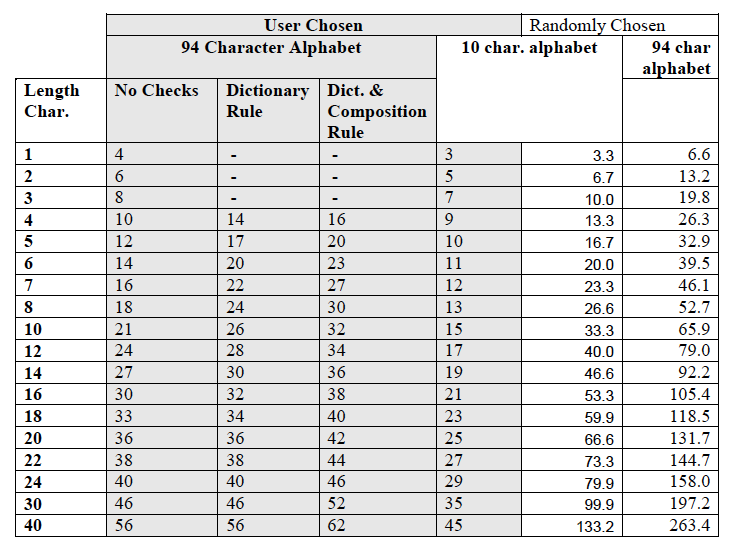

## Appendix A: Estimating Entropy and Strength

Passwords represent a very popular implementation of memorized secret
tokens. In this case impersonation of an identity requires only that the
impersonator obtain the password. Moreover, the ability of humans to
remember long, arbitrary passwords is limited, so passwords are often
vulnerable to a variety of attacks including guessing, use of
dictionaries of common passwords, and brute force attacks of all
possible password combinations. There are a wide variety of password
authentication protocols that differ significantly in their
vulnerabilities, and many password mechanisms are vulnerable to passive
and active network attacks. While some cryptographic password protocols
resist nearly all direct network attacks, these techniques are not at
present widely used and all password authentication mechanisms are
vulnerable to keyboard loggers and observation of the password when it
is entered. Experience also shows that users are vulnerable to “social
engineering” attacks where they are persuaded to reveal their passwords
to unknown parties, who are basically “confidence men.”

Claude Shannon coined the use of the term “entropy[^34]” in information
theory. The concept has many applications to information theory and
communications and Shannon also applied it to express the amount of
actual information in English text. Shannon says, “The entropy is a
statistical parameter which measures in a certain sense, how much
information is produced on the average for each letter of a text in the
language. If the language is translated into binary digits (0 or 1) in
the most efficient way, the entropy H is the average number of binary
digits required per letter of the original language.”[^35]

Entropy in this sense is at most only loosely related to the use of the
term in thermodynamics. A mathematical definition of entropy in terms of
the probability distribution function is:

where *P*(*X*=*x*) is the probability that the variable *X* has the value *x*.

Shannon was interested in strings of ordinary English text and how many
bits it would take to code them in the most efficient way possible.
Since Shannon coined the term, “entropy” has been used in cryptography
as a measure of the difficulty in guessing or determining a password or
a key. Clearly the strongest key or password of a particular size is a
truly random selection, and clearly, on average such a selection cannot
be compressed. However it is far from clear that compression is the best
measure for the strength of keys and passwords, and cryptographers have
derived a number of alternative forms or definitions of entropy,
including “guessing entropy” and “min-entropy.” As applied to a
distribution of passwords the guessing entropy is, roughly speaking, an
estimate of the average amount of work required to guess the password of
a selected user, and the min-entropy is a measure of the difficulty of
guessing the easiest single password to guess in the population.

If we had a good knowledge of the frequency distribution of passwords
chosen under a particular set of rules, then it would be straightforward
to determine either the guessing entropy or the min-entropy of any
password. An Attacker who knew the password distribution would find the
password of a chosen user by first trying the most probable password for
that chosen username, then the second most probable password for that
username and so on in decreasing order of probability until the Attacker
found the password that worked with the chosen username. The average for
all passwords would be the guessing entropy. The Attacker who is content
to find the password of any user would follow a somewhat different
strategy, he would try the most probable password with every username,
then the second most probable password with every username, until he
found the first “hit.” This corresponds to the min-entropy.

Unfortunately, we do not have much data on the passwords users choose
under particular rules, and much of what we do know is found empirically
by “cracking” passwords, that is by system administrators applying
massive dictionary attacks to the files of hashed passwords (in most
systems no plaintext copy of the password is kept) on their systems.
NIST would like to obtain more data on the passwords users actually
choose, but, where they have the data, system administrators are
understandably reluctant to reveal password data to others. Empirical
and anecdotal data suggest that many users choose very easily guessed
passwords, where the system will allow them to do so.

### A.1 Randomly Selected Passwords

As we use the term here, “entropy” denotes the uncertainty in the value
of a password. Entropy of passwords is conventionally expressed in bits.
If a password of *k* bits is chosen at random there are 2*^k* possible
values and the password is said to have *k* bits of entropy. If a
password of length *l* characters is chosen at random from an alphabet
of *b* characters (for example the 94 printable ISO characters on a
typical keyboard) then the entropy of the password is *b^l* (for
example if a password composed of 8 characters from the alphabet of 94
printable ISO characters the entropy is 94^8 ≈ 6.09 x 10^15 – this is
about 2^52, so such a password is said to have about 52 bits of
entropy). For randomly chosen passwords, guessing entropy, min-entropy,
and Shannon entropy are all the same value. The general formula for
entropy, *H* is given by:

> *H* = log~2~ (*b^l*)

Table A.1 gives the entropy versus length for a randomly generated
password chosen from the standard 94 keyboard characters (not including
the space). Calculation of randomly selected passwords from other
alphabets is straightforward.

### A.2 User Selected Passwords

It is much more difficult to estimate the entropy in passwords that
users choose for themselves, because they are not chosen at random and
they will not have a uniform random distribution. Passwords chosen by
users probably roughly reflect the patterns and character frequency
distributions of ordinary English text, and are chosen by users so that
they can remember them. Experience teaches us that many users, left to
choose their own passwords will choose passwords that are easily guessed
and even fairly short dictionaries of a few thousand commonly chosen
passwords, when they are compared to actual user chosen passwords,
succeed in “cracking” a large share of those passwords.

#### A.2.1 Guessing Entropy Estimate

Guessing entropy is arguably the most critical measure of the strength
of a password system, since it largely determines the resistance to
targeted, online password guessing attacks.

In these guidelines, we have chosen to use Shannon’s estimate of the
entropy in ordinary English text as the starting point to estimate the
entropy of user-selected passwords. It is a big assumption that
passwords are quite similar to other English text, and it would be
better if we had a large body of actual user selected passwords,
selected under different composition rules, to work from, but we have no
such resource, and it is at least plausible to use Shannon’s work for a
“ballpark” estimate. Readers are cautioned against interpreting the
following rules as anything more than a very rough rule of thumb method
to be used for the purposes of e-authentication.

Shannon conducted experiments where he gave people strings of English
text and asked them to guess the next character in the string. From this
he estimated the entropy of each successive character. He used a
27-character alphabet, the ordinary English lower case letters plus the
space.

In the following discussion we assume that passwords are user selected
from the normal keyboard alphabet of 94 printable characters, and are at
least 6-characters long. Since Shannon used a 27 character alphabet it
may seem that the entropy of user selected passwords would be much
larger, however the assumption here is that users will choose passwords
that are almost entirely lower case letters, unless forced to do
otherwise, and that rules that force them to include capital letters or
non-alphabetic characters will generally be satisfied in the simplest
and most predictable manner, often by putting a capital letter at the
start (as we do in ordinary English) and punctuation or special
characters at the end, or by some simple substitution, such as \$ for
the letter “s.” Moreover rules that force passwords to appear to be
highly random will be counterproductive because they will make the
passwords hard to remember. Users will then write the passwords down and
keep them in a convenient (that is insecure) place, such as pasted on
their monitor. Therefore it is reasonable to start from estimates of the
entropy of simple English text, assuming only a 27-symbol alphabet.

Shannon observed that, although there is a non-uniform probability
distribution of letters, it is comparatively hard to predict the first
letter of an English text string, but, given the first letter, it is
much easier to guess the second and given the first two the third is
easier still, and so on. He estimated the entropy of the first symbol at
4.6 to 4.7 bits, declining to on the order of about 1.5 bits after 8
characters. Very long English strings (for example the collected works
of Shakespeare) have been estimated to have as little as .4 bits of
entropy per character.[^36] Similarly, in a string of words, it is
harder to predict the first letter of a word than the following letters,
and the first letter carries about 6 times more information than the
fifth or later letters[^37].

An Attacker attempting to find a password will try the most likely
chosen passwords first. Very extensive dictionaries of passwords have
been created for this purpose. Because users often choose common words
or very simple passwords systems commonly impose rules on password
selection in an attempt to prevent the choice of “bad” passwords and
improve the resistance of user chosen passwords to such dictionary or
rule driven password guessing attacks. For the purposes of these
guidelines, we break those rules into two categories:

1.  Dictionary tests that test prospective passwords against an
    “extensive dictionary test” of common words and commonly used
    passwords, then disallow passwords found in the dictionary. We do
    not precisely define a dictionary test, since it must be tailored to
    the password length and rules, but it should prevent selection of
    passwords that are simple transformations of any one word found in
    an unabridged English dictionary, and should include at least
    50,000 words. There is no intention to prevent selection of long
    passwords (16 characters or more based on phrases) and no need to
    impose a dictionary test on such long passwords of 16 characters
    or more.

2.  Composition rules that typically require users to select passwords
    that include lower case letters, upper case letters, and
    non-alphabetic symbols
    (e.g.;: “\~!@\#\$%\^&\*()\_-+={}\[\]|\\:;’&lt;,&gt;.?/1234567890”).

Either dictionary tests or composition rules eliminate some passwords
and reduce the space that an adversary must test to find a password in a
guessing or exhaustion attack. However they can eliminate many obvious
choices and therefore we believe that they generally improve the
“practical entropy” of passwords, although they reduce the work required
for a truly exhaustive attack. The dictionary check requires a
dictionary of at least 50,000 legal passwords chosen to exclude commonly
selected passwords. Upper case letters in candidate passwords should be
converted to lower case before comparison.

Table A.1 provides a rough estimate of the average entropy of user
chosen passwords as a function of password length. Estimates are given
for user selected passwords drawn from the normal keyboard alphabet that
are not subject to further rules, passwords subject to a dictionary
check to prevent the use of common words or commonly chosen passwords
and passwords subject to both composition rules and a dictionary test.
In addition an estimate is provided for passwords or PINs with a
ten-digit alphabet. The table also shows the calculated entropy of
randomly selected passwords and PINs. The values of Table A.1 should not
be taken as accurate estimates of absolute entropy, but they do provide
a rough relative estimate of the likely entropy of user chosen
passwords, and some basis for setting a standard for password strength.

The logic of the Table A.1 is as follows for user-selected passwords
drawn from the full keyboard alphabet:

-   The entropy of the first character is taken to be 4 bits;

-   The entropy of the next 7 characters are 2 bits per character; this
    is roughly consistent with Shannon’s estimate that “when statistical
    effects extending over not more than 8 letters are considered the
    entropy is roughly 2.3 bits per character;”

-   For the 9th through the 20th character the entropy is taken to be
    1.5 bits per character;

-   For characters 21 and above the entropy is taken to be 1 bit per
    character;

-   A “bonus” of 6 bits of entropy is assigned for a composition rule
    that requires both upper case and non-alphabetic characters. This
    forces the use of these characters, but in many cases these
    characters will occur only at the beginning or the end of the
    password, and it reduces the total search space somewhat, so the
    benefit is probably modest and nearly independent of the length of
    the password;

-   A bonus of up to 6 bits of entropy is added for an extensive
    dictionary check. If the Attacker knows the dictionary, he can avoid
    testing those passwords, and will in any event, be able to guess
    much of the dictionary, which will, however, be the most likely
    selected passwords in the absence of a dictionary rule. The
    assumption is that most of the guessing entropy benefits for a
    dictionary test accrue to relatively short passwords, because any
    long password that can be remembered must necessarily be a
    “pass-phrase” composed of dictionary words, so the bonus declines to
    zero at 20 characters.

For user selected PINs the assumption of Table A.1 is that such pins are
subjected at least to a rule that prevents selection of all the same
digit, or runs of digits (e.g., “1234” or “76543”). This column of Table
A.1 is at best a very crude estimate, and experience with password
crackers suggests, for example, that users will often preferentially
select simple number patterns and recent dates, for example their year
of birth.

#### A.2.2 Min-Entropy Estimates

Experience suggests that a significant share of users will choose
passwords that are very easily guessed (“password” may be the most
commonly selected password, where it is allowed). Suppose, for example,
that one user in 1,000 chooses one of the 2 most common passwords, in a
system that allows a user 3 tries before locking a password. An Attacker
with a list of user names, who knows the two most commonly chosen
passwords can use an automated attack to try those 2 passwords with each
user name, and can expect to find at least one password about half the
time by trying 700 usernames with those two passwords. Clearly this is a
practical attack if the only goal is to get access to the system, rather
than to impersonate a single selected user. This is usually too
dangerous a possibility to ignore.

We know of no accurate general way to estimate the actual min-entropy of
user chosen passwords, without examining in detail the passwords that
users actually select under the rules of the password system, however it
is reasonable to argue that testing user chosen passwords against a
sizable dictionary of otherwise commonly chosen legal passwords, and
disallowing matches, will raise the min-entropy of a password. A
dictionary test is specified here that is intended to ensure at least 10
bits of min-entropy. That test is:

-   Upper case letters in passwords are converted to entirely lower case
    and compared to a dictionary of at least 50,000 commonly selected
    otherwise legal passwords and rejected if they match any dictionary
    entry, and

-   Passwords that are detectable permutations of the username are
    not allowed.

This is estimated to ensure at least 10 bits of min-entropy. Other means
may be substituted to ensure at least 10 bits of min-entropy. User
chosen passwords of at least 15 characters are assumed to have at least
10 bits of min-entropy. For example a user might be given a short
randomly chosen string (two randomly chosen characters from a 94-bit
alphabet have about 13 bits of entropy). A password, for example, might
combine short system selected random elements, to ensure 10 bits of
min-entropy, with a longer user-chosen password.

Some password systems require a user to memorize a number of images,
such as faces. Users are then typically presented with successive fields
of several images (typically 9 at a time), each of which contains one of
the memorized images. Each selection represents approximately 3.17 bits
of entropy. If such a system used five rounds of memorized images, then
the entropy of system would be approximately 16 bits. Since this is
randomly selected password the guessing entropy and min-entropy are both
the same value.

It is possible to combine randomly chosen and user chosen elements into
a single composite password. For example a user might be given a short
randomly selected value to ensure min-entropy to use in combination with
a user chosen password string. The random component might be images or a
character string.

Table A.1 - Estimated Password Guessing Entropy in bits vs. Password Length

Figure A.1 - *Estimated User Selected Password Entropy vs. Length*

