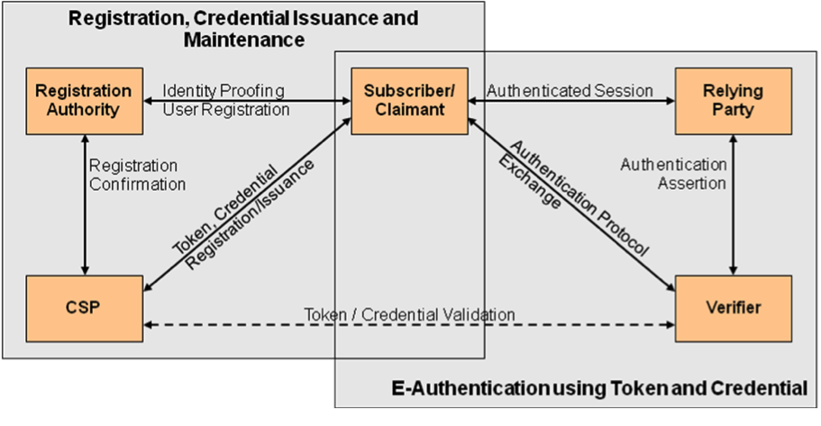

## 4. E-Authentication Model
### 4.1. Overview
In accordance with \[[OMB M-04-04](#OMB_0404)\], e-authentication is the
process of establishing confidence in user identities electronically
presented to an information system. Systems can use the authenticated
identity to determine if that individual is authorized to perform an
electronic transaction. In most cases, the authentication and
transaction take place across an open network such as the Internet;
however, in some cases access to the network may be limited and access
control decisions may take this into account.

The e-authentication model used in these guidelines reflects current
technologies and architectures used in government. More complex models
that separate functions, such as issuing credentials and providing
attributes, among larger numbers of parties are also possible and may
have advantages in some classes of applications. While a simpler model
is used in this document, it does not preclude agencies from separating
these functions.

E-authentication begins with *registration*. The usual sequence for
registration proceeds as follows. An *Applicant* applies to a
*Registration Authority (RA)* to become a *Subscriber* of a *Credential
Service Provider (CSP)*. If approved, the Subscriber is issued a
*credential* by the CSP which binds a *token* to an identifier (and
possibly one or more attributes that the RA has verified). The token may
be issued by the CSP, generated directly by the Subscriber, or provided
by a third party. The CSP registers the token by creating a *credential*
that binds the token to an identifier and possibly other attributes that
the RA has verified. The token and credential may be used in subsequent
authentication events.

The name specified in a credential may either be a *verified name* or an
*unverified name*. If the RA has determined that the name is officially
associated with a real person and the Subscriber is the person who is
entitled to use that identity, the name is considered a verified name.
If the RA has not verified the Subscriber’s name, or the name is known
to differ from the official name, the name is considered a *pseudonym*.
The process used to verify a Subscriber’s association with a name is
called identity proofing, and is performed by an RA that registers
Subscribers with the CSP. At Level 1, identity proofing is not required
so names in credentials and assertions are assumed to be pseudonyms. At
Level 2, identity proofing is required, but the credential may assert
the verified name or a pseudonym. In the case of a pseudonym, the CSP
shall retain the name verified during registration. Level 2 credentials
and assertions shall specify whether the name is a verified name or a
pseudonym. This information assists *Relying Parties (RPs)* in making
access control or authorization decisions. In most cases, only verified
names may be specified in credentials and assertions at Levels 3 and
4.[4](#note4) \(The required use of a verified name at higher levels of
assurance is derived from OMB M-04-04 and is specific to Federal IT
systems, rather than a general e-authentication requirement.\)

In this document, the party to be authenticated is called a *Claimant*
and the party verifying that identity is called a *Verifier*. When a
*Claimant* successfully demonstrates possession and control of a token
to a *Verifier* through an *authentication protocol,* the Verifier can
verify that the Claimant is the Subscriber named in the corresponding
credential. The Verifier passes on an assertion about the identity of
the Subscriber to the Relying Party (RP). That assertion includes
identity information about a Subscriber, such as the Subscriber name, an
identifier assigned at registration, or other Subscriber attributes that
were verified in the registration process (subject to the policies of
the CSP and the needs of the application). Where the Verifier is also
the RP, the assertion may be implicit. The RP can use the authenticated
information provided by the Verifier to make access control or
authorization decisions.

Authentication establishes confidence in the Claimant’s identity, and in
some cases in the Claimant’s personal attributes (for example the
Subscriber is a US Citizen, is a student at a particular university, or
is assigned a particular number or code by an agency or organization).
Authentication does not determine the Claimant’s authorizations or
access privileges; this is a separate decision. RPs (e.g., government
agencies) will use a Subscriber’s authenticated identity and attributes
with other factors to make access control or authorization decisions.

As part of authentication, mechanisms such as device identity or
geo-location could be used to identify or prevent possible
authentication false positives. While these mechanisms do not directly
increase the assurance level for authentication, they can enforce
security policies and mitigate risks. In many cases, the authentication
process and services will be shared by many applications and agencies.
However, it is the individual agency or application acting as the RP
that shall make the decision to grant access or process a transaction
based on the specific application requirements.

The various entities and interactions that comprise the e-authentication
model used here are illustrated below in Figure 1. The shaded box on the
left shows the registration, credential issuance, maintenance
activities, and the interactions between the Subscriber/Claimant, the RA
and the CSP. The usual sequence of interactions is as follows:

1.  An individual Applicant applies to an RA through a
    registration process.

2.  The RA identity proofs that Applicant.

3.  On successful identity proofing, the RA sends the CSP a registration
    confirmation message.

4.  A secret token and a corresponding credential are established
    between the CSP and the new Subscriber.

5.  The CSP maintains the credential, its status, and the registration
    data collected for the lifetime of the credential (at a
    minimum).[5](#note5) The Subscriber maintains his or her token.

Other sequences are less common, but could also achieve the same
functional requirements.

The shaded box on the right side of Figure 1 shows the entities and the
interactions related to using a token and credential to perform
e-authentication. When the Subscriber needs to authenticate to perform a
transaction, he or she becomes a Claimant to a Verifier. The
interactions are as follows:

1.  The Claimant proves to the Verifier that he or she possesses and
    controls the token through an authentication protocol.

2.  The Verifier interacts with the CSP to validate the credential that
    binds the Subscriber’s identity to his or her token.

3.  If the Verifier is separate from the RP (application), the Verifier
    provides[6](#note6) an assertion about the Subscriber to the RP, which uses
    the information in the assertion to make an access control or
    authorization decision.

4.  An authenticated session is established between the Subscriber and
    the RP.

In some cases the Verifier does not need to directly communicate with
the CSP to complete the authentication activity (e.g., some uses of
digital certificates). Therefore, the dashed line between the Verifier
and the CSP represents a logical link between the two entities rather
than a physical link. In some implementations, the Verifier, RP and the
CSP functions may be distributed and separated as shown in Figure 1;
however, if these functions reside on the same platform, the
interactions between the components are local messages between
applications running on the same system rather than protocols over
shared untrusted networks.

As noted above, CSPs maintain status information about credentials they
issue. CSPs will generally assign a finite lifetime when issuing
credentials to limit the maintenance period. When the status changes, or
when the credentials near expiration, credentials may be renewed or
re-issued; or, the credential may be revoked and/or destroyed.
Typically, the Subscriber authenticates to the CSP using his or her
existing, unexpired token and credential in order to request re-issuance
of a new token and credential. If the Subscriber fails to request token
and credential re-issuance prior to their expiration or revocation, he
or she may be required to repeat the registration process to obtain a
new token and credential. The CSP may choose to accept a request during
a grace period after expiration.

Figure 1 - *The NIST SP 800-63-1 E-Authentication Architectural Model*

### 4.2. Subscribers, Registration Authorities and Credential Service Providers
The previous section introduced the different participants in the
conceptual e-authentication model. This section provides additional
details regarding the relationships and responsibilities of the
participants involved with Registration, Credential Issuance and
Maintenance (see the box on the left hand side of Figure 1).

A user may be referred to as the Applicant, Subscriber, or Claimant,
depending on the stage in the lifecycle of the credential. An Applicant
requests credentials from a CSP. If the Applicant is approved and
credentials are issued by a CSP, the user is then termed a Subscriber of
that CSP. A user may be a Subscriber of multiple CSPs to obtain
appropriate credentials for different applications. A Claimant
participates in an authentication protocol with a Verifier to prove they
are the Subscriber named in a particular credential.

The CSP establishes a mechanism to uniquely identify each Subscriber,
register the Subscriber’s tokens, and track the credentials issued to
that Subscriber for each token. The Subscriber may be given credentials
to go with the token at the time of registration, or credentials may be
generated later as needed. Subscribers have a duty to maintain control
of their tokens and comply with the responsibilities to the CSP. The CSP
(or the RA) maintains registration records for each Subscriber to allow
recovery of registration records.

There is always a relationship between the RA and CSP. In the simplest
and perhaps the most common case, the RA and CSP are separate functions
of the same entity. However, an RA might be part of a company or
organization that registers Subscribers with an independent CSP, or
several different CSPs. Therefore a CSP may have an integral RA, or it
may have relationships with multiple independent RAs, and an RA may have
relationships with different CSPs as well.

Section 5 specifies requirements for the registration, identity proofing
and issuance processes.

### 4.3. Tokens
The classic paradigm for authentication systems identifies three factors
as the cornerstone of authentication:

-   *Something you know* (for example, a password)

-   *Something you have* (for example, an ID badge or a
    cryptographic key)

-   *Something you are* (for example, a fingerprint or other
    biometric data)

Multi-factor authentication refers to the use of more than one of the
factors listed above. The strength of authentication systems is largely
determined by the number of factors incorporated by the system.
Implementations that use two factors are considered to be stronger than
those that use only one factor; systems that incorporate all three
factors are stronger than systems that only incorporate two of the
factors. (As discussed in Section 4.1, other types of information, such
as location data or device identity, may be used by an RP or Verifier to
reject or challenge a claimed identity, but they are not considered
authentication factors.)

In e-authentication, the base paradigm is slightly different: the
Claimant possesses and controls a token that has been registered with
the CSP and is used to prove the bearer’s identity. The token contains a
secret the Claimant can use to prove that he or she is the Subscriber
named in a particular credential.[7](#note7) In e-authentication, the Claimant
authenticates to a system or application over a network by proving that
he or she has possession and control of a token. The token provides an
output called a token authenticator. This output is used in the
authentication process to prove that the Claimant possesses and controls
the token (refer to Section 6.1 for more details), demonstrating that
the Claimant is the person to whom the token was issued. Depending on
the type of token, this authenticator may or may not be unique for
individual authentication operations.

The secrets contained in tokens are based on either *public key pairs*
(asymmetric keys) or *shared secrets*.

A *public key* and a related private key comprise a public key pair. The
*private key* is stored on the token and is used by the Claimant to
prove possession and control of the token. A Verifier, knowing the
Claimant’s public key through some credential (typically a *public key
certificate*), can use an authentication protocol to verify the
Claimant’s identity, by proving that the Claimant has possession and
control of the associated private key token.

Shared secrets stored on tokens may be either *symmetric keys* or
passwords. While they can be used in similar protocols, one important
difference between the two is how they relate to the subscriber. While
symmetric keys are generally stored in hardware or software that the
Subscriber controls, passwords tend to be memorized by the Subscriber.
As such, keys are something the Subscriber has, while passwords are
something he or she knows. Since passwords are committed to memory, they
usually do not have as many possible values as cryptographic keys, and,
in many protocols, are vulnerable to network attacks that are
impractical for keys. Moreover the entry of passwords into systems
(usually through a keyboard) presents the opportunity for very simple
keyboard logging attacks, and it may also allow those nearby to learn
the password by watching it being entered. Therefore, keys and passwords
demonstrate somewhat separate authentication properties (something you
have rather than something you know). However, when using either public
key pairs or shared secrets, the Subscriber has a duty to maintain
exclusive control of his or her token, since possession and control of
the token is used to authenticate the Claimant’s identity. Token threats
are discussed more in Section 6.2.

In this document, e-authentication tokens always contain a secret. So,
some of the classic authentication factors do not apply directly to
e-authentication. For example, an ID badge is *something you have*, and
is useful when authenticating to a human (e.g., a guard), but is not a
token for e-authentication. Authentication factors classified as
*something you know* are not necessarily secrets, either. Knowledge
based authentication, where the claimant is prompted to answer questions
that can be confirmed from public databases, also does not constitute an
acceptable secret for e-authentication. More generally, *something you
are* does not generally constitute a secret. Accordingly, this
recommendation does not permit the use of biometrics as a token.

However, this recommendation does accept the notional model that
authentication systems that incorporate all three factors offer better
security than systems that only incorporate two of the factors. An
e-authentication system may incorporate multiple factors in either of
two ways. The system may be implemented so that multiple factors are
presented to the Verifier, or some factors may be used to protect a
secret that will be presented to the Verifier. If multiple factors are
presented to the Verifier, each will need to be a token (and therefore
contain a secret). If a single factor is presented to the Verifier, the
additional factors are used to protect the token and need not themselves
be tokens.

For example, consider a piece of hardware (the token) which contains a
cryptographic key (the token secret) where access is protected with a
fingerprint. When used with the biometric, the cryptographic key
produces an output (the token authenticator) which is used in the
authentication process to authenticate the Claimant. An impostor must
steal the encrypted key (by stealing the hardware) and replicate the
fingerprint to use the token. This specification considers such a device
to effectively provide two factor authentication, although the actual
authentication protocol between the Verifier and the Claimant simply
proves possession of the key.

As noted above, biometrics, when employed as a single factor of
authentication, do not constitute acceptable secrets for
e-authentication, but they do have their place in this specification.
Biometric characteristics are unique personal attributes that can be
used to verify the identity of a person who is physically present at the
point of verification. They include facial features, fingerprints, DNA,
iris and retina scans, voiceprints and many other characteristics. This
publication recommends that biometrics be used in the registration
process for higher levels of assurance to later help prevent a
Subscriber who is registered from repudiating the registration, to help
identify those who commit registration fraud, and to unlock tokens.

Section 6 provides guidelines on the various types of tokens that may be
used for electronic authentication.

### 4.4. Credentials
As described in the preceding sections, e-authentication credentials
bind a token to the Subscriber’s name as part of the issuance process.
Credentials are issued and maintained by the CSP; Verifiers use the
credentials to authenticate the Claimant’s identity based on possession
and control of the corresponding token. This section provides additional
background regarding the relationship of credentials in the
e-authentication model with traditional (paper) credentials and
describes common e-authentication credentials.

Paper credentials are documents that attest to the identity or other
attributes of an individual or entity called the subject of the
credentials. Some common paper credentials include passports, birth
certificates, driver’s licenses, and employee identity cards. The
authenticity of paper credentials is established in a variety of ways:
traditionally perhaps by a signature or a seal, special papers and inks,
high quality engraving, and today by more complex mechanisms, such as
holograms, that make the credentials recognizable and difficult to copy
or forge. In some cases, simple possession of the credentials is
sufficient to establish that the physical holder of the credential is
indeed the subject of the credentials. More commonly, the credentials
contain information such as the subject’s description, a picture of the
subject or the handwritten signature of the subject, which can be used
to authenticate that the holder of the credentials is indeed the subject
of the credentials. When these paper credentials are presented
in-person, the information contained in those credentials can be checked
to verify that the physical holder of the credential is the subject.

E-authentication credentials may be considered the electronic analog to
paper credentials. In both cases, a valid credential authoritatively
binds an identity to the necessary information for verifying that a
person is entitled to claim that identity. However, the use cases differ
in several significant aspects.

The Subject simply possesses and presents the paper credentials in most
authentication scenarios. Since they are generally easy to copy, mere
possession of a valid electronic credential is rarely a sufficient basis
for successful authentication. The e-authentication Claimant possesses a
token and presents a token authenticator, but is not necessarily in
possession of the electronic credentials. For example, password database
entries are considered to be credentials for the purpose of this
document but are possessed by the Verifier. X.509 public key
certificates are a classic example of credentials the Claimant can (and
often does) possess.

As was the case for paper credentials, in order to authenticate a
Claimant using an electronic credential, the Verifier shall also
validate the credential itself (i.e. confirm that the credential was
issued by an authorized CSP and has not subsequently expired or been
revoked.) There are two ways this can be done: If the credential has
been signed by the CSP, the verifier can validate it by checking the
signature. Otherwise, validation may be done interactively by querying
the CSP directly through a secure protocol.

In the remainder of this document, the term “credentials” refers to
electronic credentials unless explicitly noted. Section 7 provides
guidelines for token and credential management activities that are
applicable to electronic authentication.

### 4.5. Authentication Process
The authentication process begins with the Claimant demonstrating
possession and control of a token that is bound to the asserted identity
to the Verifier through an authentication protocol. Once possession and
control has been demonstrated, the Verifier verifies that the credential
remains valid, usually by interacting with the CSP.

The exact nature of the interaction between the Verifier and the
Claimant during the authentication protocol is extremely important in
determining the overall security of the system. Well designed protocols
can protect the integrity and confidentiality of traffic between the
Claimant and the Verifier both during and after the authentication
exchange, and it can help limit the damage that can be done by an
Attacker masquerading as a legitimate Verifier. Additionally, mechanisms
located at the Verifier can mitigate online guessing attacks against
lower entropy secrets like passwords and PINs by limiting the rate at
which an Attacker can make authentication attempts or otherwise delaying
incorrect attempts. (Generally, this is done by keeping track of and
limiting the number of unsuccessful attempts, since the premise of an
online guessing attack is that most attempts will fail.)

The Verifier is a functional role, but is frequently implemented in
combination with the CSP and/or the RP. If the Verifier is a separate
entity from the CSP, it is often desirable to ensure that the Verifier
does not learn the subscriber’s token secret in the process of
authentication, or at least to ensure that the Verifier does not have
unrestricted access to secrets stored by the CSP.

Section 8 provides guidelines for the various types of protocols used by
the Verifier to authenticate the Claimant/Subscriber within the
e-authentication model.

### 4.6. Assertions
Upon completion of the authentication process, the Verifier generates an
assertion containing the result of the authentication and provides it to
the RP. If the Verifier is implemented in combination with the RP, the
assertion is implicit. If the Verifier is a separate entity from the RP,
the assertion is used to pass information about the Claimant or the
authentication process from the Verifier to the RP. Assertions may be
communicated directly to the RP, or can be forwarded through the
Claimant, which has further implications for system design.

An RP trusts an assertion based on the source, the time of creation, and
attributes associated with the Claimant. The Verifier is responsible for
providing a mechanism by which the integrity of the assertion can be
confirmed. The RP is responsible for authenticating the source (the
Verifier) and for confirming the integrity of the assertion. When the
Verifier passes the assertion through the Claimant, the Verifier shall
protect the integrity of the assertion in such a way that it cannot be
modified by the Claimant. However, if the Verifier and the RP
communicate directly, a protected session may be used to provide the
integrity protection. When sending assertions across an open network,
the Verifier is responsible for ensuring that any sensitive Subscriber
information contained in the assertion can only be extracted by an RP
that it trusts to maintain the information’s confidentiality.

Examples of assertions include:

-   *Cookies* – Cookies are character strings, placed in memory, which
    are available to websites within the same Internet domain as the
    server that placed them in the web browser. Cookies are used for
    many purposes and may be assertions or may contain pointers to
    assertions.[8](#note8)

-   *SAML Assertions* – SAML assertions are specified using a mark-up
    language intended for describing security assertions. They can be
    used by a Verifier to make a statement to an RP about the identity
    of a Claimant. SAML assertions may optionally be digitally signed.

-   *Kerberos Tickets* – Kerberos Tickets allow a ticket granting
    authority to issue session keys to two authenticated parties using
    symmetric key based encapsulation schemes.

Section 9 provides guidelines for the use of assertions in
authentication protocols.

### 4.7. Relying Parties
An RP relies on results of an electronic authentication protocol to
establish confidence in the identity or attributes of a Subscriber for
the purpose of some transaction. RPs will use a Subscriber’s
authenticated identity, the overall authentication assurance level, and
other factors to make access control or authorization decisions. The
Verifier and the RP may be the same entity, or they may be separate
entities. If they are separate entities, the RP normally receives an
assertion from the Verifier. The RP ensures that the assertion came from
a Verifier trusted by the RP. The RP also processes any additional
information in the assertion, such as personal attributes or expiration
times.

Section 9 provides guidelines for the assertions that may be used by RPs
to establish confidence in the identities of Claimants when the RP and
the Verifier are not co-located.

### 4.8. Calculating the Overall Authentication Assurance Level

The overall authentication assurance level is based on the low watermark
of the assurance levels for each of the components of the architecture.
For instance, to achieve an overall assurance level of 3:

-   The registration and identity proofing process shall, at a minimum,
    use Level 3 processes or higher.

-   The token (or combination of tokens) used shall have an assurance
    level of 3 or higher.

-   The binding between the identity proofing and the token(s), if
    proofing is done separately from token issuance, shall be
    established at level 3.

-   The authentication protocols used shall have a Level 3 assurance
    level or higher.

-   The token and credential management processes shall use a Level 3
    assurance level or higher.

-   Authentication assertions (if used) shall have a Level 3 assurance
    or higher.

The low watermark is the basis for the overall level because the lowest
level will likely be the target of the Attacker. For example, if a
system uses a token for authentication that has Level 2 assurance, but
uses other mechanisms that have Level 3 assurance, the Attacker will
likely focus on gaining access to the token since it is easier to attack
a system component meeting assurance Level 2 rather than attacking those
meeting assurance Level 3. (See Sections 5 through 9 for information on
assurance levels for each area.)

---
**Footnotes**

<a name="note4">4</a>: Note that [FIPS 201] permits authorized pseudonyms in limited cases and does not differentiate between credentials using authorized pseudonyms. Nothing in these guidelines should be interpreted as contravening the contents of the FIPS or constraining the use of these authorized pseudonymous credentials. See Appendix B for the level of PIV credentials.

<a name="note5">5</a>: CSPs may be required to maintain this information beyond the lifetime of the credential to support auditing or satisfy archiving requirements.

<a name="note6">6</a>: Many assertion protocols require assertions to be forwarded through the Claimant’s local system before reaching the Relying Party. For Details, see Section 10.

<a name="note7">7</a>: The stipulation that every token contains a secret is specific to these E-authentication guidelines.  As noted elsewhere authentication techniques where the token does not contain a secret may be applicable to authentication problems in other environments (e.g., physical access).

<a name="note8">8</a>: There are specific requirements that agencies must follow when implementing cookies. See OMB Memorandum M-10-22, OMB Guidance for Online Use of Web Measurement and Customization Technologies, available at: http://www.whitehouse.gov/sites/default/files/omb/assets/memoranda_2010/m10-22.pdf as well as OMB Memorandum M-03-22, OMB Guidance for Implementing the Privacy Provisions of the E-Government Act of 2002, available at: http://www.whitehouse.gov/omb/memoranda/m03-22.html.
