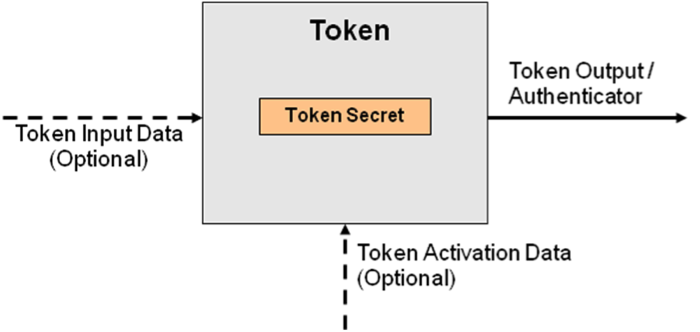

## 6. Tokens
The concept of a token was introduced in Section 4. This section
provides a more in-depth treatment of e-authentication tokens. Section
6.1 describes classes of tokens recognized by this recommendation and
how they can be combined in practice. Section 6.2 identifies threats and
mitigation strategies applicable to tokens. Section 6.3 maps recognized
classes of tokens to assurance levels and identifies any required threat
mitigation strategies.

### 6.1. Overview

In the e-authentication context, a token contains a secret to be used in
authentication processes. Tokens are possessed by a Claimant and
controlled through one or more of the traditional authentication factors
(*something you know*, *have*, or *are*). Figure 2 depicts an abstract
model for a token.

The outer box shown in Figure 2 is the token. Tokens may exist in
hardware (e.g., a smart card), software (e.g., a software cryptographic
module), or may only exist in human memory. The inner box represents the
token secret that is stored within the token. The output of a token is
the *token* *authenticator*, which is the value that is provided to the
protocol stack for transmission to the Verifier to prove that the
Claimant possesses and controls the token. The token authenticator may
be the token secret, or a transformation of the token secret.

There are two optional inputs to the token: *token input data*; and
*token activation data.* Token input data, such as a challenge or nonce,
may be required to generate the token authenticator. Token input data
may be supplied by the user or be a feature of the token itself (e.g.
the clock in an OTP device). Token activation data, such as a PIN or
biometric, may be required to activate the token and permit generation
of an authenticator. Token activation data is needed when a Claimant
controls the token through *something you know* or *something you are*.
(Where the token is something you know, such as a password or memorized
secret, token activation is implicit.)

The *authenticator* is generated through the use of the token. In the
general case, an authenticator is generated by performing a mathematical
function using the token secret and one or more optional token input
values (a nonce or challenge):

*Authenticator = Function (&lt;token secret&gt; \[, &lt;nonce&gt;\] \[,
&lt;challenge&gt;\] )*

As noted above, in the trivial case, the authenticator may be the token
secret itself (e.g., where the token is a password).

Figure 2 - *Token Model*

#### 6.1.1. Single-factor versus Multi-factor Tokens
Tokens are characterized by the number and types of authentication
factors that they use. (See Section 4.3 for discussion on three types of
authentication factors.) For example, a password is something you know,
a biometric is something you are, and a cryptographic identification
device is something you have. Tokens may be single-factor or
multi-factor tokens as described below:

-   *Single-factor Token* – A token that uses one of the three factors
    to achieve authentication. For example, a password is *something you
    know*. There are no additional factors required to activate the
    token, so this is considered single factor.

-   *Multi-factor Token* – A token that uses two or more factors to
    achieve authentication. For example, a private key on a smart card
    that is activated via PIN is a multi-factor token. The smart card is
    *something you have*, and *something you know* (the PIN) is required
    to activate the token.

This document does not differentiate between tokens that require two
factors and three factors, as two factors are sufficient to achieve the
highest level recognized in this document. Other applications or
environments may require such a differentiation.

#### 6.1.2. Token Types
These guidelines recognize the following types of tokens for
e-authentication.

-   *Memorized Secret Token* – A secret shared between the Subscriber
    and the CSP. Memorized Secret Tokens are typically character strings
    (e.g., passwords and passphrases) or numerical strings (e.g., PINs.)
    The token authenticator presented to the Verifier in an
    authentication process is the secret itself (e.g. the password or
    passphrase itself). Memorized secret tokens are *something you
    know*.

-   *Pre-registered Knowledge Token* – A series of responses to a set of
    prompts or challenges. These responses may be thought of as a set of
    shared secrets. The set of prompts and responses are established by
    the Subscriber and CSP during the registration process. The token
    authenticator is the set of memorized responses to pre-registered
    prompts during a single run of the authentication process. An
    example of a Pre-registered Knowledge Token would be establishing
    responses for prompts such as “What was your first pet’s name?”
    During the authentication process, the Claimant is asked to provide
    the appropriate responses to a subset of the prompts. Alternatively,
    a Subscriber might select and memorize an image during the
    registration process. In an authentication process, the Claimant is
    prompted to identify the correct images from a set(s) of
    similar images. Transactions from previously authenticated sessions
    could be accepted as Pre-registered Knowledge Tokens. Pre-registered
    Knowledge Tokens are *something you know*.

-   *Look-up Secret Token* – A physical or electronic token that stores
    a set of secrets shared between the Claimant and the CSP. The
    Claimant uses the token to look up the appropriate secret(s) needed
    to respond to a prompt from the Verifier (the token input). For
    example, a Claimant may be asked by the Verifier to provide a
    specific subset of the numeric or character strings printed on a
    card in table format. The token authenticator is the secret(s)
    identified by the prompt. Look-up secret tokens are *something you
    have*.

-   *Out of Band Token* – A physical token that is uniquely addressable
    and can receive a Verifier-selected secret for one-time use. The
    device is possessed and controlled by the Claimant and supports
    private communication[20](#note20) over a channel that is separate from the
    primary channel for e-authentication. The token authenticator is the
    received secret and is presented to the Verifier using the primary
    channel for e-authentication. For example, a Claimant attempts to
    log into a website and receives a text message on his or her
    cellular phone, PDA, pager, or land line (pre-registered with the
    CSP during the registration phase) with a random authenticator to be
    presented as a part of the electronic authentication protocol. Out
    of Band Tokens are *something you have*.

-   *Single-factor (SF) One-Time Password (OTP) Device* – A hardware
    device that supports the spontaneous generation of
    one-time passwords. This device has an embedded secret that is used
    as the seed for generation of one-time passwords and does not
    require activation through a second factor. Authentication is
    accomplished by providing an acceptable one-time password and
    thereby proving possession and control of the device. The token
    authenticator is the one-time password. For example, a one-time
    password device may display 6 characters at a time. SF OTP devices
    are *something you have*.

-   *Single-factor (SF) Cryptographic Device* – a hardware device that
    performs cryptographic operations on input provided to the device.
    This device does not require activation through a second factor
    of authentication. This device uses embedded symmetric or asymmetric
    cryptographic keys. Authentication is accomplished by proving
    possession of the device. The token authenticator is highly
    dependent on the specific cryptographic device and protocol, but it
    is generally some type of signed message. For example, in TLS, there
    is a “certificate verify” message. SF Cryptographic Devices are
    *something you have*.

-   *Multi-factor (MF) Software Cryptographic Token* – A cryptographic
    key is stored on disk or some other “soft” media and requires
    activation through a second factor of authentication. Authentication
    is accomplished by proving possession and control of the key. The
    token authenticator is highly dependent on the specific
    cryptographic protocol, but it is generally some type of
    signed message. For example, in TLS, there is a “certificate
    verify” message. The MF software cryptographic token is *something
    you have*, and it may be activated by either *something you know* or
    *something you are*.

-   *Multi-factor (MF) One-Time Password (OTP) Device* – A hardware
    device that generates one-time passwords for use in authentication
    and which requires activation through a second factor
    of authentication. The second factor of authentication may be
    achieved through some kind of integral entry pad, an integral
    biometric (e.g., fingerprint) reader or a direct computer interface
    (e.g., USB port). The one-time password is typically displayed on
    the device and manually input to the Verifier as a password,
    although direct electronic input from the device to a computer is
    also allowed. The token authenticator is the one-time password. For
    example, a one-time password device may display 6 characters at
    a time. The MF OTP device is *something you have*, and it may be
    activated by either *something you know* or *something you are*.

-   *Multi-factor (MF) Cryptographic Device* – A hardware device that
    contains a protected cryptographic key that requires activation
    through a second authentication factor. Authentication is
    accomplished by proving possession of the device and control of
    the key. The token authenticator is highly dependent on the specific
    cryptographic device and protocol, but it is generally some type of
    signed message. For example, in TLS, there is a “certificate
    verify” message. The MF Cryptographic device is *something you
    have*, and it may be activated by either *something you know* or
    *something you are*.

#### 6.1.3. Token Usage

An authentication process may involve a single token, or a combination
of two or more tokens, as described below.

-   *Single-token authentication* – The Claimant presents a single token
    authenticator to prove his or her identity to the Verifier. For
    example, when a Claimant attempts to log into a password protected
    website, the Claimant enters a username and password. In this
    instance, only the password would be considered to be a token.

-   *Multi-token authentication* – The Claimant presents token
    authenticators generated by two or more tokens to prove his or her
    identity to the Verifier. The combination of tokens is characterized
    by the combination of factors used by the tokens (both inherent in
    the manifestation of the tokens, and those used to activate
    the tokens). A Verifier that requires a Claimant to enter a password
    and use a single-factor cryptographic device is an example of
    multi-token authentication. The combination is considered
    multi-factor, since the password is *something you know* and the
    cryptographic device is *something you have.*

#### 6.1.4. Multi-Stage Authentication Using Tokens

Multi-stage authentication processes, which use a single-factor token to
obtain a second token, do not constitute multi-factor authentication.
The level of assurance associated with the compound solution is the
assurance level of the weakest token.

For example, some cryptographic mobility solutions allow full or partial
cryptographic keys to be stored on an online server and downloaded to
the Claimant’s local system after successful authentication using a
password or passphrase. Subsequently, the Claimant can use the
downloaded software cryptographic token to authenticate to a remote
Verifier for e-authentication. This type of solution is considered only
as strong as the password provided by the Claimant to obtain the
cryptographic token.

#### 6.1.5. Assurance Level Escalation

In certain circumstances, it may be desirable to raise the assurance
level of an e-authentication session between a Subscriber and an RP in
the middle of the application session. This guideline recognizes a
special case of multi-token authentication, where a primary token is
used to establish a secure session, and a secondary token is used later
in the session to present a second token authenticator. Even though the
two tokens were not used at the same time, this document recognizes the
result as a multi-token authentication scheme (which may upgrade the
overall level of assurance). In these authentication scenarios, the
level of assurance achieved by the two stages in combination is the same
as a multi-token authentication scheme using the same set of tokens.
Table 7 describes the highest level of assurance achievable through a
combination of two token types.

### 6.2. Token Threats
An Attacker who can gain control of a token will be able to masquerade
as the token’s owner. Threats to tokens can be categorized based on
attacks on the types of authentication factors that comprise the token:

-   *Something you have* may be lost, damaged, stolen from the owner or
    cloned by the Attacker. For example, an Attacker who gains access to
    the owner’s computer might copy a software token. A hardware token
    might be stolen, tampered with, or duplicated.

-   *Something you know* may be disclosed to an Attacker. The Attacker
    might guess a password or PIN. Where the token is a shared secret,
    the Attacker could gain access to the CSP or Verifier and obtain the
    secret value. An Attacker may observe the entry of a PIN or
    passcode, find a written record or journal entry of a PIN or
    passcode, or may install malicious software (e.g., a
    keyboard logger) to capture the secret. Additionally, an Attacker
    may determine the secret through off-line attacks on network traffic
    from an authentication attempt. Finally, an Attacker may be able to
    gain information about a Subscriber’s Pre-registered Knowledge
    researching the subscriber or through other social
    engineering techniques. (For example, the subscriber might refer to
    his or her first pet in a conversation or blog.)

-   *Something you are* may be replicated. An Attacker may obtain a copy
    of the token owner’s fingerprint and construct a replica - assuming
    that the biometric system(s) employed do not block such attacks by
    employing robust liveness detection techniques

This document assumes that the Subscriber is not colluding with the
Attacker who is attempting to falsely authenticate to the Verifier. With
this assumption in mind, the threats to the token(s) used for
e-authentication are listed in Table 4, along with some examples.

Table 4 – Token Threats

| **Token Threats/Attacks**  | **Description**  | **Examples** |
|----------------------------|------------------|--------------|
| Theft | A physical token is stolen by an Attacker. | A hardware cryptographic device is stolen. |
| | | A One-Time Password device is stolen. |
| | | A look-up secret token is stolen. |
| | | A cell phone is stolen. |
| Discovery | The responses to token prompts are easily discovered through searching various data sources. | The question “What high school did you attend?” is asked as a Pre-registered Knowledge Token, when the answer is commonly found on social media websites. |
| Duplication | The Subscriber’s token has been copied with or without his or her knowledge. | Passwords written on paper are disclosed.
| | | Passwords stored in an electronic file are copied. |
| | | Software PKI token (private key) copied. |
| | | Look-up token copied. |
| Eavesdropping | The token secret or authenticator is revealed to the Attacker as the Subscriber is submitting the token to send over the network. | Passwords are learned by watching keyboard entry. |
| | | Passwords are learned by keystroke logging software. |
| | | A PIN is captured from PIN pad device. |
| Offline cracking | The token is exposed using analytical methods outside the authentication mechanism. | A key is extracted by differential power analysis on stolen hardware cryptographic token. |
| | | A software PKI token is subjected to dictionary attack to identify the correct password to use to decrypt the private key. |
| Phishing or pharming | The token secret or authenticator is captured by fooling the Subscriber into thinking the Attacker is a Verifier or RP. | A password is revealed by Subscriber to a website impersonating the Verifier.
| | | A password is revealed by a bank Subscriber in response to an email inquiry from a Phisher pretending to represent the bank. |
| | | A password is revealed by the Subscriber at a bogus Verifier website reached through DNS re-routing.
| Social engineering | The Attacker establishes a level of trust with a Subscriber in order to convince the Subscriber to reveal his or her token or token secret. | A password is revealed by the Subscriber to an officemate asking for the password on behalf of the Subscriber’s boss. |
| | | A password is revealed by a Subscriber in a telephone inquiry from an Attacker masquerading as a system administrator. |
| Online guessing | The Attacker connects to the Verifier online and attempts to guess a valid token authenticator in the context of that Verifier. | Online dictionary attacks are used to guess passwords. |
| | | Online guessing is used to guess token authenticators for a one-time password token registered to a legitimate Claimant. |

#### 6.2.1. Threat Mitigation Strategies
Token related mechanisms that assist in mitigating the threats
identified above are summarized in Table 5.

Table 5 - Mitigating Token Threats

| **Token Threat/Attack** | **Threat Mitigation Mechanisms** |
|-------------------------|----------------------------------|
| Theft | - Use multi-factor tokens which need to be activated through a PIN or biometric.|
| Duplication |  - Use tokens that are difficult to duplicate, such as hardware cryptographic tokens. |
| Discovery | - Use methods in which the responses to prompts cannot be easily discovered.
| Eavesdropping | - Use tokens with dynamic authenticators where knowledge of one authenticator does not assist in deriving a subsequent authenticator.
| | - Use tokens that generate authenticators based on a token input value.
| | - Establish tokens through a separate channel.
| Offline cracking | - Use a token with a high entropy token secret
| | - Use a token that locks up after a number of repeated failed activation attempts.
| Phishing or pharming | - Use tokens with dynamic authenticators where knowledge of one authenticator does not assist in deriving a subsequent authenticator.
| Social engineering | - Use tokens with dynamic authenticators where knowledge of one authenticator does not assist in deriving a subsequent authenticator.
| Online guessing | - Use tokens that generate high entropy authenticators.

There are several other strategies that may be applied to mitigate the
threats described in Table 5:

-   *Multiple factors* make successful attacks more difficult
    to accomplish. If an Attacker needs to steal a cryptographic token
    and guess a password, then the work to discover both factors may be
    too high.

-   *Physical security mechanisms* may be employed to protect a stolen
    token from duplication. Physical security mechanisms can provide
    tamper evidence, detection, and response.

-   *Imposing password complexity rules* may reduce the likelihood of a
    successful guessing attack. Requiring the use of long passwords that
    don’t appear in common dictionaries may force Attackers to try every
    possible password.

-   *System and network security controls* may be employed to prevent an
    Attacker from gaining access to a system or installing
    malicious software.

-   *Periodic training* may be performed to ensure the Subscriber
    understands when and how to report compromise (or suspicion
    of compromise) or otherwise recognize patterns of behavior that may
    signify an Attacker attempting to compromise the token.

-   *Out of band techniques* may be employed to verify proof of
    possession of registered devices (e.g., cell phones).

### 6.3. Token Assurance Levels

This section discusses the requirements for tokens used at various
levels of assurance.

#### 6.3.1. Requirements per Assurance Level

The following sections list token requirements for single and
multi-token authentication.

##### 6.3.1.1. Single Token Authentication

Table 6 lists the assurance levels that may be achieved by each of the
token types when used in a single-token authentication scheme. The
requirements for each token are listed per assurance level. If token
requirements are listed only at one assurance level, the token may be
used at lower levels but shall satisfy the requirements given at
whatever level is listed. If there is more than one box under “Verifier
Requirements” for a given token type, it is only necessary to satisfy
the requirements in one box.

Table 6 - Token Requirements Per Assurance Level

| **Token Type** | **Level** | **Token Requirements** | **Verifier Requirements**
|----------------|-----------|------------------------|------------|
|  Memorized Secret Token | Level 1 | The memorized secret may be a user chosen string consisting of 6 or more characters chosen from an alphabet of 90 or more characters, a randomly generated PIN consisting of 4 or more digits, or a secret with equivalent entropy.[21](#note21) | The Verifier shall implement a throttling mechanism that effectively limits the number of failed authentication attempts an Attacker can make on the Subscriber’s account to 100 or fewer in any 30-day period. |
| | |  |Note: While an implementation that simply counted all failed authentication attempts in each calendar month and locked out the account when the limit was exceeded would technically meet the requirement, this is a poor choice for reasons of system availability. See Section 8.2.3 for more detailed advice. |
| | Level 2 | The memorized secret may be a randomly generated PIN consisting of 6 or more digits, a user generated string consisting of 8 or more characters chosen from an alphabet of 90 or more characters, or a secret with equivalent entropy.[21](#note21) | The Verifier shall implement a throttling mechanism that effectively limits the number of failed authentication attempts an Attacker can make on the Subscriber’s account to 100 or fewer in any 30-day period. |
| | |CSP implements dictionary or composition rule to constrain user-generated secrets. | Note: While an implementation that simply counted all failed authentication attempts in each calendar month and locked out the account when the limit was exceeded would technically meet the requirement, this is a poor choice for reasons of system availability. See Section 8.2.3 for more detailed advice. |
| Pre-Registered Knowledge Token | Level 1 | The secret provides at least 14 bits of entropy.[21](#note21) | The Verifier shall implement a throttling mechanism that effectively limits the number of failed authentication attempts an Attacker can make on the Subscriber’s account to 100 or fewer in any 30-day period.
| | | | Note: While an implementation that simply counted all failed authentication attempts in each calendar month and locked out the account when the limit was exceeded would technically meet the requirement, this is a poor choice for reasons of system availability. See Section 8.2.3 for more detailed advice. |
| | |The entropy in the secret cannot be directly calculated, e.g., user chosen or personal knowledge questions. If the questions are not supplied by the user, the user shall select prompts from a set of at least five questions. | For these purposes, an empty answer is prohibited. The Verifier shall verify the answers provided for at least three questions, and shall implement a throttling mechanism that effectively limits the number of failed authentication attempts an Attacker can make on the Subscriber’s account to 100 or fewer in any 30-day period. |
| | | | Note: While an implementation that simply counted all failed authentication attempts in each calendar month and locked out the account when the limit was exceeded would technically meet the requirement, this is a poor choice for reasons of system availability. See Section 8.2.3 for more detailed advice. |
| | Level 2 | The secret provides at least 20 bits of entropy.[21](#note21) | The Verifier shall implement a throttling mechanism that effectively limits the number of failed authentication attempts an Attacker can make on the Subscriber’s account to 100 or fewer in any 30-day period. |
| | | | Note: While an implementation that simply counted all failed authentication attempts in each calendar month and locked out the account when the limit was exceeded would technically meet the requirement, this is a poor choice for reasons of system availability. See Section 8.2.3 for more detailed advice. |
| | | The entropy in the secret cannot be directly calculated, e.g., user chosen or personal knowledge questions. If the questions are not supplied by the user, the user shall select prompts from a set of at least seven questions.| For these purposes, an empty answer is prohibited. The Verifier shall verify the answers provided for at least five questions, and shall implement a throttling mechanism that effectively limits the number of failed authentication attempts an Attacker can make on the Subscriber’s account to 100 or fewer in any 30-day period.
| | | |Note: While an implementation that simply counted all failed authentication attempts in each calendar month and locked out the account when the limit was exceeded would technically meet the requirement, this is a poor choice for reasons of system availability. See Section 8.2.3 for more detailed advice.
| Look-up Secret Token | Level 2 | The token authenticator has 64 bits of entropy.[21](#note21) | N/A |
| | | The token authenticator has at least 20 bits of entropy.[21](#note21) | The Verifier shall implement a throttling mechanism that effectively limits the number of failed authentication attempts an Attacker can make on the Subscriber’s account to 100 or fewer in any 30-day period. |
| | | | Note: While an implementation that simply counted all failed authentication attempts in each calendar month and locked out the account when the limit was exceeded would technically meet the requirement, this is a poor choice for reasons of system availability. See Section 8.2.3 for more detailed advice. |
| Out of Band Token | Level 2 | The token is uniquely addressable and supports communication over a channel that is separate from the primary channel for e-authentication. | The Verifier generated secret shall have at least 64 bits of entropy.[21](#note21) |
| | | | The Verifier generated secret shall have at least 20 bits of entropy[21](#note21) and the Verifier shall implement a throttling mechanism that effectively limits the number of failed authentication attempts an Attacker can make on the Subscriber’s account to 100 or fewer in any 30-day period. |
| | | | Note: While an implementation that simply counted all failed authentication attempts in each calendar month and locked out the account when the limit was exceeded would technically meet the requirement, this is a poor choice for reasons of system availability. See Section 8.2.3 for more detailed advice. |
| SF One-Time Password Device | Level 2 | Shall use Approved block cipher or hash function to combine a symmetric key stored on device with a nonce to generate a one-time password. The nonce may be a date and time, or a counter generated on the device. | The one-time password shall have a limited lifetime, on the order of minutes. The cryptographic module performing the verifier function shall be validated at FIPS 140-2 Level 1 or higher.[22](#note22)
| SF Cryptographic Device | Level 2 | The cryptographic module shall be validated at FIPS 140-2 Level 1 or higher.[22](#note22) | Verifier generated token input (e.g., a nonce or challenge) has at least 64 bits of entropy.[21](#note21)
| MF Software Cryptographic Token | Level 3 | The cryptographic module shall be validated at FIPS 140-2 Level 1 or higher.[22](#note22) Each authentication shall require entry of the password or other activation data and the unencrypted copy of the authentication key shall be erased after each authentication. | Verifier generated token input (e.g., a nonce or challenge) has at least 64 bits of entropy.[21](#note21)
| MF OTP Hardware Token | Level 4 | Cryptographic module shall be FIPS 140-2 validated Level 2 or higher; with physical security at FIPS 140-2 Level 3 or higher.[22](#note22) The one-time password shall be generated by using an Approved block cipher or hash function to combine a symmetric key stored on a personal hardware device with a nonce to generate a one-time password. The nonce may be a date and time, a counter generated on the device. Each authentication shall require entry of a password or other activation data through an integrated input mechanism.| The one-time password shall have a limited lifetime of less than 2 minutes.
| MF Hardware Cryptographic Token | Level 4 | Cryptographic module shall be FIPS 140-2 validated, Level 2 or higher; with physical security at FIPS 140-2 Level 3 or higher[22](#note22) Shall require the entry of a password, PIN, or biometric to activate the authentication key. Shall not allow the export of authentication keys. | Verifier generated token input (e.g., a nonce or challenge) has at least 64 bits of entropy.[21](#note21)

##### 6.3.1.2. Multi-Token Authentication

When two of the token types are combined for a multi-token
authentication scheme, Table 7 shows the highest possible assurance
level that can be achieved by the combination.[23](#note23)

Table 7 - Assurance Levels for Multi-Token E-Authentication Schemes[24](#note24)

| | **Memorized Secret Token** | **Pre-registered Knowledge Token** | **Look-up Secret Token** |  **Out of Band Token** | **SF OTP Device** | **SF Crypto-graphic Device** | **MF Software Crypto-graphic Token** | **MF OTP Device** | **MF Crypto-graphic Device** |
|---|:--------------------------:|:----------------------------------:|:------------------------:|:--------------------:|:-----------------:|:----------------------------:|:-----------------------------------------:|:-----------------:|:-----------------------------:|
| **Memorized Secret Token** | Level 2 | Level 2 | Level 3 | Level 3 | Level 3 | Level 3 |                       Level 3 | Level 4 | Level 4 |
| **Pre-registered Knowledge Token** | X | Level 2 | Level 3 | Level 3 | Level 3 | Level 3 | Level 3 | Level 4 | Level 4 |
| **Look-up Secret Token** | X | X | Level 2 | Level 2 | Level 2 | Level 2 | Level 3 | Level 4 | Level 4 |
| **Out of Band Token** | X | X | X | Level 2 | Level 2 | Level 2 | Level 3 | Level 4 | Level 4 |
| **SF OTP Device** | X | X | X | X | Level 2 | Level 2 | Level 3 | Level 4 | Level 4 |
| **SF Cryptographic Device** | X | X | X | X | X | Level 2 | Level 3 | Level 4 | Level 4 |
| **MF Software Cryptographic Token** | X | X | X | X | X | X | Level 3 | Level 4 | Level 4 |
| **MF OTP Device** | X | X | X | X | X | X | X | Level 4 | Level 4 |
| **MF Cryptographic Device** | X | X | X | X | X | X | X | X | Level 4 |

The principles used in generating Table 7 are as follows. Level 3 can be
achieved using two tokens rated at Level 2 that represent two different
factors of authentication. Since this specification does not address the
use of biometrics as a stand-alone token for remote authentication,
achieving Level 3 with separate Level 2 tokens implies *something you
have* and *something you know*:

Token (Level 2, *something you have*) + Token (Level 2, *something you
know*) → Token(Level 3)

In all other cases, combinations of tokens are considered to achieve the
Level of the highest rated token.

For example, a Memorized Secret Token combined with a Look-up Secret
Token can be used to achieve Level 3 authentication, since the look-up
secret token is “something you have” and the Memorized Secret Token is
“something you know”. However, combining a MF software cryptographic
token (which is rated at Level 3) and a Memorized Secret Token (which is
rated at Level 2) achieves an overall level of 3, since the addition of
the Memorized Secret Token does not increase the assurance of the
combination.

It should be noted that to achieve Level 4 with a single token or token
combination, one of the tokens needs to be usable with an authentication
process that strongly resists man-in-the-middle attacks. While it is
possible to meet this requirement with a wide variety of token types,
certain choices of tokens may complicate the task of designing a
protocol that meets Level 4 requirements for authentication process (as
described in Section 8 of this document). In particular, one-time
password devices that rely exclusively on the human user for input and
output may be especially problematic and may need to be supplemented
with a software cryptographic token to provide strong man-in-the-middle
resistance.

---
**Footnotes**

<a name="note20">20</a>: Private communication means the Verifier’s message is sent directly to the Claimant’s device.

<a name="note21">21</a>: For more information, see Table A.1 in Appendix A.

<a name="note22">22</a>: Products validated under subsequent versions of FIPS 140-2 are also acceptable.

<a name="note23">23</a>: Note that the table displays tokens that exhibit the properties of “something you have” and “something you know”.

<a name="note24">24</a>: The boxes marked with an “x” denote that the combination already appears in the table
