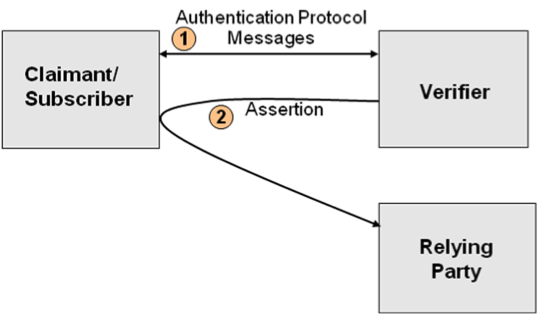
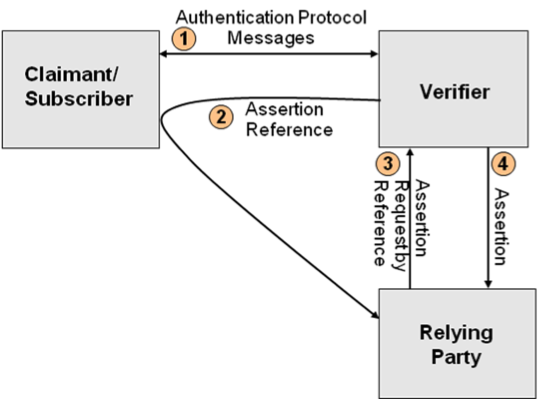
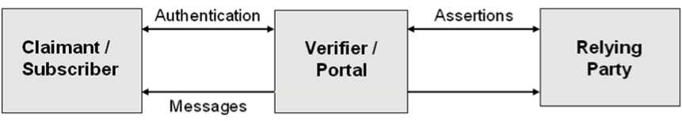

## 9. Assertions

### 9.1. Overview

Assertions are statements from a Verifier to an RP that contain
information about a Subscriber. Assertions are used when the RP and the
Verifier are not collocated (i.e., they are connected through a shared
network). The RP uses the information in the assertion to identify the
Claimant and make authorization decisions about his or her access to
resources controlled by the RP. An assertion may include identification
and authentication statements regarding the Subscriber, and may
additionally include attribute statements that further characterize the
Subscriber and support the authorization decision at the RP.

Assertion-based authentication of the Claimant serves several important
goals. It supports the process of Single-Sign-On for Claimants, allowing
them to authenticate once to a Verifier and subsequently obtain services
from multiple RPs without being aware of further authentication.
Assertion mechanisms also support the implementation of a federated
identity for a Subscriber, allowing the linkage of multiple
identities/accounts held by the Subscriber with different RPs through
the use of a common “federated” identifier. In this context, a
federation is a group of entities (RPs, Verifiers and CSPs) that are
bound together through common agreed-upon business practices, policies,
trust mechanisms, profiles and protocols. Finally, assertion mechanisms
can also facilitate authentication schemes that are based on the
attributes or characteristics of the Claimant in lieu of (or in addition
to) the identity of the Claimant. Attributes are often used in
determining access privileges for Attributes Based Access Control (ABAC)
or Role Based Access Control (RBAC).

It is important to note that assertion schemes are fairly complex
multiparty protocols, and therefore have fairly subtle security
requirements which shall be satisfied. When evaluating a particular
assertion scheme, it may be instructive to break it down into its
component interactions. Generally speaking, interactions between the
Claimant/Subscriber and the Verifier and between the Claimant/Subscriber
and RP are similar to the authentication mechanisms presented in Section
8, while interactions between the Verifier and RP are similar to the
*token and credential verification services* presented in Section 7.
Many of the requirements presented in this section will, therefore, be
similar to corresponding requirements in those two sections.

There are two basic models for assertion-based authentication. After
successful authentication with the Verifier, the Subscriber is issued an
assertion or an assertion reference, which the Subscriber uses to
authenticate to the RP.

-   *The Direct Model* – In the direct model, the Claimant uses his or her
    e-authentication token to authenticate to the Verifier. Following
    successful authentication of the Claimant, the Verifier creates an
    assertion, and sends it to the Subscriber to be forwarded to the RP.
    The assertion is used by the Claimant/Subscriber to authenticate to
    the RP. (This is usually handled automatically by the
    Subscriber’s browser.) Figure 4 illustrates this model.

Figure 4 - *Direct Assertion Model*

-   *The Indirect Model* – In the indirect model, the Claimant uses his
    or her token to authenticate to the Verifier. Following successful
    authentication, the Verifier creates an assertion as well as an
    assertion reference (which identifies the Verifier and includes a
    pointer to the full assertion held by the Verifier). The assertion
    reference is sent to the Subscriber to be forwarded to the RP. In
    this model, the assertion reference is used by the
    Claimant/Subscriber to authenticate to the RP. The RP then uses the
    assertion reference to explicitly request the assertion from
    the Verifier. Figure 5 illustrates this model.

Figure 5 - *Indirect Assertion Model*

As mentioned earlier, an assertion contains a set of claims or
statements about an authenticated Subscriber. Based on the statements
contained within it, an authentication assertion will fall into one of
two categories (and either category can be used in both direct and
indirect models):

-   *Holder-of-Key Assertions* – A holder-of-key assertion contains a
    reference to a symmetric key or a public key (corresponding to a
    private key) possessed by the Subscriber. The RP may require the
    Subscriber to prove possession of the secret that is referenced in
    the assertion. In proving possession of the Subscriber’s secret, the
    Subscriber also proves with a certain degree of assurance that he or
    she is the rightful owner of the assertion. It is therefore
    difficult for an Attacker to use a holder-of-key assertion issued to
    a Subscriber, since the former cannot prove possession of the secret
    referenced within the assertion.

-   *Bearer Assertions* – A bearer assertion does not provide a
    mechanism for the Claimant to prove that he or she is the rightful
    owner of the assertion. The RP has to assume that the assertion was
    issued to the Subscriber who presents the assertion or the
    corresponding assertion reference to the RP. If a bearer assertion
    (in the direct model) or assertion reference (in the indirect model)
    belonging to a Subscriber is captured, copied, or manufactured by an
    Attacker, the latter can impersonate the rightful Subscriber to
    obtain services from the RP. Bearer assertions can be made secure
    only if some part of the assertion or assertion reference, sent to
    the Subscriber by the Verifier, is unpredictable to an Attacker and
    can reliably be kept secret.

There are cases in which the RP should be anonymous to the Verifier for
the purpose of privacy. The direct model is more suitable for the
“anonymous RP” scenario since there is no requirement for the RP to
authenticate to the Verifier as in the indirect model. However, it is
possible to devise authentication schemes (e.g., using key hierarchies
within a group or federation) that allow the use of the indirect model
to support the “anonymous RP” scenario.

There are other cases where privacy concerns require that the Claimant’s
identity/account at the Verifier and RP not be linked through use of a
common identifier/account name. In such scenarios, pseudonymous
identifiers are used within the assertions generated by the Verifier for
the RP.

It should be noted that the two models described above are abstractions.
There may be other interactions between the three players preceding or
interspersed with the interactions described in the model. For example,
the Claimant may initiate a connection with an RP of his or her choice,
at which point, the latter would redirect the Claimant to an appropriate
Verifier to be authenticated using the direct model, resulting in an
assertion being sent to the RP. Alternately, the Claimant may first
authenticate to a Verifier of his or her choice and then select one or
more RPs to obtain further services. The direct model is used to
generate assertions for each of these RPs. Parallel scenarios may be
constructed for the indirect model as well.

There is one other basic assertion model.

-   *The Proxy Model* – In the proxy model, the Claimant uses his or her
    e-authentication token to authenticate to the Verifier. Following
    successful authentication of the Claimant, the Verifier creates an
    assertion and includes it when interacting directly with the RP,
    acting as an intermediary between the Claimant and the RP. Figure 6
    illustrates this model.

Figure 6 – *Proxy Model*

The RP grants or denies the request based, at least in part, on the
authentication assertion made by the Verifier. There are several
common reasons for such proxies:

-   Portals that provide users access to multiple RPs that require user
    authentication

-   Web caching mechanisms that are required to satisfy the RP’s access
    control policies, especially when client-authenticated TLS with the
    Claimant is required

-   Network monitoring and/or filtering mechanisms that terminate TLS in
    order to inspect and manipulate the traffic

	It is good practice to protect communications between the Verifier and
	the RP. Current commercial implementations tend to do this by having
	the proxy use client-authenticated TLS with the Verifier and pass the
	authentication assertion in the HTTP header.

	Note that the Verifier may have access to information that may be
	useful to the RP in enforcing security policies, such as device
	identity, location, system health checks, and configuration
	management. If so, it may be a good idea to pass this information
	along to the RP.

Three types of assertion technologies will be discussed within this
section: Web browser cookies, SAML (Security Assertion Markup Language)
assertions, and Kerberos tickets. Other assertion technologies may be
used in an e-authentication environment as long as they meet the
requirements set forth in Section 9.3 below for the targeted assurance
level.

#### 9.1.1. Cookies

One type of assertion widely in use is Web cookie technology. Cookies
are text files used by a browser to store information provided by a
particular web site. The contents of the cookie are sent back to the web
site each time the browser requests a page from the same web site. The
web site uses the contents of the cookie to identify the user and
prepare customized Web pages for that user, or to authorize the user for
certain transactions.

Cookies have two mandatory parameters:

-   *Name* – This parameter states the name of the cookie.

-   *Value* – This parameter holds information that a cookie is storing.
    For example, the value parameter could hold a user ID or session ID.

Cookies also have four optional parameters:

-   *Expiration date* – This parameter determines how long the cookie
    stays valid.

-   *Path* – This parameter sets the path over which the cookie
    is valid.

-   *Domain* – This parameter determines the domain in which the cookie
    is valid.

-   *Secure* – This parameter indicates the cookie requires that a
    secure connection exist for the cookie to be used.

There are two types of cookies:

-   *Session cookies* – A cookie that is erased when the user closes the
    web browser. The session cookie is stored in temporary memory and is
    not retained after the browser is closed.

-   *Persistent cookies* – A cookie that is stored on a user’s hard
    drive until it expires (persistent cookies are set with
    expiration dates) or until the user deletes the cookie.

Cookies are effective as assertions for Internet single-sign-on where
the RP and Verifier are part of the same Internet domain, and when the
cookie contains authentication status for that domain. They are not
usable in scenarios where the RP and the Verifier are part of disparate
domains.

Cookies are also often used by the Claimant to re-authenticate to a
server. This may be considered to be a use of assertion technology. In
this case, the server acts as a Verifier when it sets the cookie in the
Subscriber’s browser, and as an RP when it requests the cookie from a
Claimant who wishes to re-authenticate to it. Often, the cookie contains
a random number, and the assertion data that it represents does not
leave the server. Note that, if the cookie is used as an assertion
reference in this way, no assertion needs to be sent on an open network,
and therefore, confidentiality and integrity requirements for assertion
data at Level 2 and below may be satisfied by access controls rather
than by cryptographic methods. (The cookie itself, however, does need to
be protected.) This is in line with the credential storage requirement
presented in Section 7.

#### 9.1.2. Security Assertion Markup Language (SAML) Assertions

SAML is an XML-based framework for creating and exchanging
authentication and attribute information between trusted entities over
the Internet. As of this writing, the latest specification for
\[[SAML](#SAML)\] is SAML v2.0, issued 15 March 2005.

The building blocks of SAML include the Assertions XML schema which
define the structure of the assertion; the SAML Protocols which are used
to request assertions and artifacts (that is, the assertion reference
mentioned in Section 9.1); and the Bindings that define the underlying
communication protocols (such as HTTP or SOAP) and that can be used to
transport the SAML assertions. The three components above define a SAML
profile that corresponds to a particular use case such as “Web Browser
SSO”.

SAML Assertions are encoded in an XML schema and can carry up to three
types of statements:

-   *Authentication statements* – Include information about the
    assertion issuer, the authenticated subject, validity period, and
    other authentication information. For example, an Authentication
    Assertion would state the subject “John” was authenticated using a
    password at 10:32pm on 06-06-2004.

-   *Attribute statements* – Contain specific additional characteristics
    related to the Subscriber. For example, subject “John” is associated
    with attribute “Role” with value “Manager”.

-   *Authorization statements* – Identify the resources the Subscriber
    has permission to access. These resources may include specific
    devices, files, and information on specific web servers. For
    example, subject “John” for action “Read” on “Webserver1002” given
    evidence “Role”.

Authorization statements are beyond the scope of this document and will
not be discussed.

#### 9.1.3. Kerberos Tickets

The Kerberos Network Authentication Service \[[RFC 4120](#RFC4120)\] was
designed to provide strong authentication for client/server applications
using symmetric-key cryptography. Extensions to Kerberos can support the
use of public key cryptography for selected steps of the protocol.
Kerberos also supports confidentiality and integrity protection of
session data between the Subscriber and the RP.

Kerberos supports authentication of a Claimant over an untrusted, shared
network using two or more Verifiers. The Claimant implicitly
authenticates to the Verifier by demonstrating the ability to decrypt a
random session key encrypted for the Subscriber by the Verifier. (Some
Kerberos variants also require the Subscriber to explicitly authenticate
to the Verifier, but this is not universal.) In addition to the
encrypted session key, the Verifier also generates another encrypted
object called a Kerberos ticket. The ticket contains the same session
key, the identity of the Subscriber to whom the session key was issued,
and an expiration time after which the session key is no longer valid.
The ticket is confidentiality and integrity protected by a
pre-established that is key shared between the Verifier and the RP.

To authenticate using the session key, the Claimant sends the ticket to
the RP along with encrypted data that proves that the Claimant possesses
the session key embedded within the Kerberos ticket. Session keys are
either used to generate new tickets, or to encrypt and authenticate
communications between the Subscriber and the RP.

To begin the process, the Claimant sends an authentication request to
the Authentication Server (AS). The AS encrypts a session key for the
Subscriber using the Subscriber’s long term credential. The long term
credential may either be a secret key shared between the AS and the
Subscriber, or in the PKINIT variant of Kerberos, a public key
certificate. It should be noted that most variants of Kerberos based on
a shared secret key between the Subscriber and Verifier derive this key
from a user generated password. As such, they are vulnerable to offline
dictionary attack by a passive eavesdropper.

In addition to delivering the session key to the subscriber, the AS also
issues a ticket using a key it shares with the Ticket Granting Server
(TGS). This ticket is referred to as a Ticket Granting Ticket (TGT),
since the verifier uses the session key in the TGT to issue tickets
rather than to explicitly authenticate the Claimant. The TGS uses the
session key in the TGT to encrypt a new session key for the Subscriber
and uses a key it shares with the RP to generate a ticket corresponding
to the new session key. The subscriber decrypts the session key and uses
the ticket and the new session key together to authenticate to the RP.

### 9.2. Assertion Threats

In this section, it is assumed that the two endpoints of the assertion
transmission (namely, the Verifier and the RP) are uncompromised.
However, the Claimant is not assumed to be entirely trustworthy as the
Claimant may have an interest in modifying or replacing an assertion to
obtain a greater level of access to a resource/service provided by the
RP. Other Attackers are assumed to lurk within the shared transmission
medium (e.g., Internet) and may be interested in obtaining or modifying
assertions and assertion references to impersonate a Subscriber or
access unauthorized data or services. Furthermore, it is possible that
two or more entities may be colluding to attack another party. An
Attacker may attempt to subvert assertion protocols by directly
compromising the integrity or confidentiality of the assertion data. For
the purpose of this type of threat, authorized parties who attempt to
exceed their privileges may be considered Attackers.

-   *Assertion manufacture/modification* – An Attacker may generate a
    bogus assertion or modify the assertion content (such as the
    authentication or attribute statements) of an existing assertion,
    causing the RP to grant inappropriate access to the Subscriber. For
    example, an Attacker may modify the assertion to extend the validity
    period; a Subscriber may modify the assertion to have access to
    information that they should not be able to view.

-   *Assertion disclosure* – Assertions may contain authentication and
    attribute statements that include sensitive Subscriber information.
    Disclosure of the assertion contents can make the Subscriber
    vulnerable to other types of attacks.

-   *Assertion repudiation by the Verifier* – An assertion may be
    repudiated by a Verifier if the proper mechanisms are not in place.
    For example, if a Verifier does not digitally sign an assertion, the
    Verifier can claim that it was not generated through the services of
    the Verifier.

-   *Assertion repudiation by the Subscriber* – Since it is possible for
    a compromised or malicious subscriber to issue assertions to the
    wrong party, a subscriber can repudiate any transaction with the RP
    that was authenticated using only a bearer assertion.

-   *Assertion redirect*: An Attacker uses the assertion generated for
    one RP to obtain access to a second RP.

-   *Assertion reuse* – An Attacker attempts to use an assertion that
    has already been used once with the intended RP.

In addition to reliable and confidential transmission of assertion data
from the Verifier to the RP, assertion protocols have a further goal: in
order for the Subscriber to be recognized by the RP, he or she shall be
issued some secret information, the knowledge of which distinguishes the
Subscriber from Attackers who wish to impersonate the Subscriber. In the
case of holder-of-key assertions, this secret is generally the
Subscriber’s long term token secret, which would already have been
established with the CSP prior to the initiation of the assertion
protocol.[31](#note31)

In other cases, however, the Verifier will generate a temporary secret
and transmit it to the authenticated Subscriber for this purpose. Since,
when this secret is used to authenticate to the RP, it generally
replaces the token authenticator in the type of protocols described in
Section 8, this temporary secret will be referred to here as a secondary
authenticator. Secondary authenticators include assertions in the direct
model, session keys in Kerberos, assertion references in the indirect
model, and cookies used for authentication. The threats to the secondary
authenticator are as follows:

-   *Secondary authenticator manufacture* – An Attacker may attempt to
    generate a valid secondary authenticator and use it to impersonate
    a Subscriber.

-   *Secondary authenticator capture* – The Attacker may use a session
    hijacking attack to capture the secondary authenticator when the
    Verifier transmits it to the Subscriber after the primary
    authentication step, or the Attacker may use a man-in-the-middle
    attack to obtain the secondary authenticator as it is being used by
    the Subscriber to authenticate to the RP. If, as in the indirect
    model, the RP needs to send the secondary authenticator back to the
    Verifier in order to check its validity or obtain the corresponding
    assertion data, an Attacker may similarly subvert the communication
    protocol between the Verifier and the RP to capture a
    secondary authenticator. In any of the above scenarios, the
    secondary authenticator can be used to impersonate the Subscriber.

Finally, in order for the Subscriber’s authentication to the RP to be
useful, the binding between the secret used to authenticate to the RP
and the assertion data referring to the Subscriber shall be strong.

-   *Assertion substitution* – A subscriber may attempt to impersonate a
    more privileged subscriber by subverting the communication channel
    between the Verifier and RP, for example by reordering the messages,
    to convince the RP that his or her secondary authenticator
    corresponds to assertion data sent on behalf of the more
    privileged subscriber. This is primarily a threat to the indirect
    model, since in the direct model, assertion data is directly encoded
    in the secondary authenticator.

#### 9.2.1. Threat Mitigation Strategies

Mitigation techniques are described below for each of the threats
described in the last subsection.

Logically speaking, an assertion is issued by a Verifier and consumed by
an RP – these are the two end points of the session that needs to be
secured to protect the assertion. In the direct model, the session in
which the assertion is passed traverses the Subscriber. Furthermore, in
the current web environment, the assertion may pass through two separate
secure sessions (one between the Verifier and the Subscriber, and the
other between the Subscriber and the RP), with a break in session
security on the Subscriber’s browser. This is reflected in the
mitigation strategies described below. In the indirect model, the
assertion flows directly from the Verifier to the RP; this protocol
session needs to be protected. All of the threat mitigation strategies
in Section 8 apply to the protocols used to request, retrieve and submit
assertions and assertion references.

-   *Assertion manufacture/modification*: To mitigate this threat, one
    of the following mechanisms may be used:

1.  The assertion may be digitally signed by the Verifier. The RP should
    check the digital signature to verify that it was issued by a
    legitimate Verifier.

2.  The assertion may be sent over a protected session such as TLS. In
    order to protect the integrity of assertions from malicious attack,
    the Verifier shall be authenticated.

-   *Assertion disclosure* – To mitigate this threat, one of the
    following mechanisms may be implemented:

1.  The assertion may be sent over a protected session to an
    authenticated RP. Note that, in order to protect assertions against
    both disclosure and manufacture/modification using a protected
    session, both the RP and the Verifier need to be authenticated.

2.  If assertions are signed by the Verifier, they may be encrypted for
    a specific RP with no additional integrity protection. It should be
    noted that any protocol that requires a series of messages between
    two parties to be signed by their source and encrypted for their
    recipient provides all the same guarantees as a mutually
    authenticated protected session, and may therefore be
    considered equivalent. The general requirement for protecting
    against both assertion disclosure and assertion
    manufacture/modification may therefore be described as a mutually
    authenticated protected session or equivalent between Verifier
    and RP.

-   *Assertion repudiation by the Verifier* – To mitigate this threat,
    the assertion may be digitally signed by the Verifier using a key
    that supports non-repudiation. The RP should check the digital
    signature to verify that it was issued by a legitimate Verifier.

-   *Assertion repudiation by the Subscriber* – To mitigate this threat,
    the Verifier may issue holder of key, rather than bearer assertions.
    The Subscriber can then prove possession of the asserted key to
    the RP. If the asserted key matches the subscriber’s long term
    credential (as provided by the CSP) it will be clear to all parties
    involved that it was the Subscriber who authenticated to the RP
    rather than a compromised Verifier impersonating the Subscriber.

-   *Assertion redirect* – To mitigate this threat, the assertion may
    include the identity of the RP for whom it was generated. The RP
    verifies that incoming assertions include its identity as the
    recipient of the assertion.

-   *Assertion reuse* – To mitigate this threat, the following
    mechanisms may be used:

1.  The assertion includes a timestamp and has a short lifetime
    of validity. The RP checks the timestamp and lifetime values to
    ensure that the assertion is currently valid. The lifetime value may
    either be in the assertion or set by the RP.

2.  The RP keeps track of assertions that were consumed within
    a (configurable) time window to ensure that an assertion cannot be
    used more than once within that time window.

-   *Secondary authenticator manufacture* – To mitigate this threat, one
    of the following mechanisms may be implemented:

1.  The secondary authenticator may contain sufficient entropy that an
    Attacker without direct access to the Verifier’s random number
    generator cannot guess the value of a valid secondary authenticator.

2.  The secondary authenticator may contain timely assertion data that
    is signed by the Verifier or integrity protected using a key shared
    between the Verifier and the RP.

3.  The Subscriber may authenticate to the RP directly using his or her
    long term token and avoid the need for a secondary
    authenticator altogether.

-   *Secondary authenticator capture* – To mitigate this threat,
    adequate protections shall be in place throughout the lifetime of
    any secondary authenticators used in the assertion protocol.

1.  In order to protect the secondary authenticator while it is in
    transit between the Verifier and the Subscriber, the secondary
    authenticator shall be sent via a protected session established
    during the primary authentication of the Subscriber using his or
    her token. This requirement is the same as the requirement in
    Section 8, regarding the Authentication Process, to protect
    sensitive data (in this case the secondary authenticator) from
    session hijacking attacks.

2.  In order to protect the secondary authenticator from capture as it
    is submitted to the RP, the secondary authenticator shall be used in
    an authentication protocol which protects against eavesdropping and
    man-in-the-middle attacks as described in Section 8.

3.  In order to protect the secondary authenticator after it has been
    used, it shall never be transmitted on an unprotected session or to
    an unauthenticated party while it is still valid. The secondary
    authenticator may be sent in the clear only if the sending party has
    strong assurances that the secondary authenticator will not
    subsequently be accepted by any other RP. This is possible if the
    secondary authenticator is specific to a single RP, and if that RP
    will not accept secondary authenticators with the same value until
    the maximum lifespan of the corresponding assertion has passed.

-   *Assertion substitution* – To mitigate this threat, one of the
    following mechanisms may be implemented:

1.  Responses to assertion requests, signed or integrity protected by
    the Verifier, may contain the value of the assertion reference used
    in the request or some other nonce that was cryptographically bound
    to the request by the RP.

2.  Responses to assertion requests may be bound to the corresponding
    requests by message order, as in HTTP, provided that assertions and
    requests are protected by a protocol such as TLS that can detect and
    disallow malicious reordering of packets.

### 9.3. Assertion Assurance Levels

The stipulations for assertion assurance levels are described in the
next sections.

#### 9.3.1 Threat Resistance per Assurance Level

Table 12 lists the requirements for assertions (both in the direct and
indirect models) and assertion references (in the indirect model) at
each assurance level in terms of resistance to the threats listed above.

Table 12 – Threat Resistance per Assurance Level

| **Threat** | **Level 1** | **Level 2** | **Level 3** | **Level 4** |
|------------|:-----------:|:-----------:|:-----------:|:-----------:|
  Assertion manufacture/modification | Yes | Yes | Yes | Yes |
  Assertion disclosure | No | Yes | Yes | Yes |
  Assertion repudiation by Verifier | No | No | Yes[32](#note32) | Yes[32](#note32) |
  Assertion repudiation by Subscriber | No | No | No | Yes[32](#note32) |
  Assertion redirect | No | Yes | Yes | Yes |
  Assertion reuse | Yes | Yes | Yes | Yes |
  Secondary authenticator manufacture | Yes | Yes | Yes | Yes |
  Secondary authenticator capture | No | Yes | Yes | Yes |
  Assertion substitution | No | Yes | Yes | Yes |

#### 9.3.2. Requirements per Assurance Level

The following sections summarize the requirements for assertions at each
assurance level.

All assertions recognized within this guideline shall indicate the
assurance level of the initial authentication of the Claimant to the
Verifier. The assurance level indication within the assertion may be
implicit (e.g., through the identity of the Verifier implicitly
indicating the resulting assurance level) or explicit (e.g., through an
explicit field within the assertion).

##### 9.3.2.1. Level 1

At Level 1, it must be impractical for an Attacker to manufacture an
assertion or assertion reference that can be used to impersonate the
Subscriber. If the direct model is used, the assertion which is used
shall be signed by the Verifier or integrity protected using a secret
key shared by the Verifier and RP, and if the indirect model is used,
the assertion reference which is used shall have a minimum of 64 bits of
entropy. Bearer assertions shall be specific to a single
transaction.[33](#note33) Also, if assertion references are used, they shall be
freshly generated whenever a new assertion is created by the Verifier.
In other words, bearer assertions and assertion references are generated
for one-time use.

Furthermore, in order to protect assertions against modification in the
indirect model, all assertions sent from the Verifier to the RP shall
either be signed by the Verifier, or transmitted from an authenticated
Verifier via a protected session. In either case, a strong mechanism
must be in place which allows the RP to establish a binding between the
assertion reference and its corresponding assertion, based on integrity
protected (or signed) communications with the authenticated Verifier.

To lessen the impact of captured assertions and assertion references,
assertions that are consumed by an RP which is not part of the same
Internet domain as the Verifier shall expire if they are not used within
5 minutes of their creation. Assertions intended for use within a single
Internet domain, including assertions contained in or referenced by
cookies, however, may last as long as 12 hours without being used.

##### 9.3.2.2. Level 2

If the underlying credential specifies that the subscriber name is a
pseudonym, this information must be conveyed in the assertion. Level 2
assertions shall be protected against manufacture/modification, capture,
redirect and reuse. Assertion references shall be protected against
manufacture, capture and reuse. Each assertion shall be targeted for a
single RP and the RP shall validate that it is the intended recipient of
the incoming assertion.

All stipulations from Level 1 apply. Additionally, assertions, assertion
references and any session cookies used by the Verifier or RP for
authentication purposes, shall be transmitted to the Subscriber through
a protected session which is linked to the primary authentication
process in such a way that session hijacking attacks are resisted (see
Section 8.2.2 for methods which may be used to protect against session
hijacking attacks). Assertions, assertion references and session cookies
shall not be subsequently transmitted over an unprotected session or to
an unauthenticated party while they remain valid. (To this end, any
session cookies used for authentication purposes shall be flagged as
secure, and redirects used to forward secondary authenticators from the
Subscriber to the RP shall specify a secure protocol such as HTTPS.)

To protect assertions against manufacture, modification, and disclosure,
assertions which are sent from the Verifier to the RP, whether directly
or through the Subscriber’s device, shall either be sent via a mutually
authenticated protected session between the Verifier and RP, or
equivalently shall be signed by the Verifier and encrypted for the RP.

All assertion protocols used at Level 2 and above require the use of
Approved cryptographic techniques. As such, the use of Kerberos keys
derived from user generated passwords is not permitted at Level 2 or
above.

##### 9.3.2.3. Level 3

At Level 3, in addition to Level 2 requirements, assertions shall be
protected against repudiation by the Verifier; all assertions used at
Level 3 shall be signed. Level 3 assertions shall specify verified names
and not pseudonyms.

Kerberos uses symmetric key mechanisms to protect key management and
session data, and it does not protect against assertion repudiation.
However, based on the high degree of vetting conducted on the Kerberos
protocol and its wide deployment, Kerberos tickets are acceptable for
use as assertions at Level 3 as long as:

-   All Verifiers (Kerberos Authentication Servers and Ticket
    Granting Servers) are under the control of a single management
    authority that ensures the correct operation of the Kerberos
    protocol;

-   The Subscriber authenticates to the Verifier using a Level 3 token;

-   All Level 3 requirements unrelated to non-repudiation are satisfied.

Also, at Level 3, single-domain assertions (e.g., Web browser cookies)
shall expire if they are not used within 30 minutes. Cross-domain
assertions shall expire if not used within 5 minutes.

However, in order to deliver the effect of single sign on, the Verifier
may re-authenticate the Subscriber prior to delivering assertions to new
RPs, using a combination of long term and short term single domain
assertions provided that the following assurances are met:

-   The Subscriber has successfully authenticated to the Verifier within
    the last 12 hours.

-   The Subscriber can demonstrate that he or she was the party that
    authenticated to the Verifier. This could be demonstrated, for
    example, by the presence of a cookie set by the Verifier in the
    Subscriber’s browser.

-   The Verifier can reliably determine whether the Subscriber has been
    in active communication with an RP since the last assertion was
    delivered by the Verifier. This means that the Verifier needs
    evidence that the Subscriber is actively using the services of the
    RP and has not been idle for more than 30 minutes. An authenticated
    assertion by the RP to this effect is considered sufficient evidence
    for this purpose.

#### 9.3.2.4. Level 4

At Level 4, bearer assertions (including cookies) shall not be used to
establish the identity of the Claimant to the RP. Assertions made by the
Verifier may however be used to bind keys or other attributes to an
identity. Holder-of-key assertions may be used, provided that all three
requirements below are met:

-   The Claimant authenticates to the Verifier using a Level 4 token (as
    described in Section 6) in a Level 4 authentication protocol (as
    described in Section 8).

-   The Verifier generates a holder-of-key assertion that references a
    key that is part of the Level 4 token (used to authenticate to
    the Verifier) or linked to it through a chain of trust, and;

-   The RP verifies that the Subscriber possesses the key that is
    referenced in the holder-of-key assertion using a Level 4 protocol
    (where the RP plays the role attributed to the Verifier by
    Section 8).

The RP should maintain records of the assertions it receives, so that if
a suspicious transaction occurs at the RP, the key asserted by the
Verifier may be compared to the value registered with the CSP. This
record keeping allows the RP to detect any attempt by the Verifier to
impersonate the Subscriber using fraudulent assertions and may also be
useful for preventing the Subscriber from repudiating various aspects of
the authentication process.

Kerberos uses symmetric key mechanisms to protect key management and
session data, and it does not protect against assertion repudiation by
the Subscriber or the Verifier. However, based on the high degree of
vetting conducted on the Kerberos protocol and its wide deployment,
Kerberos tickets are acceptable for use as assertions at Level 4 as long
as:

-   All Verifiers (Kerberos Authentication Servers and Ticket
    Granting Servers) are under the control of a single management
    authority that ensures the correct operation of the Kerberos
    protocol;

-   The Subscriber authenticates to the Verifier using a Level 4 token;

-   All Level 4 requirements unrelated to non-repudiation are satisfied.

All Level 1-3 requirements for the protection of assertion data remain
in force at Level 4.

---
**Footnotes**

<a name="note31">31</a>: The role of the Verifier in such protocols is not necessarily to issue new secrets. Rather, in a holder-of-key-assertion, the Verifier communicates the information in the Subscriber’s credential (as well as any supplementary information from the CSP such as revocation data) to the RP. The Verifier also vouches that the holder-of-key assertion represents current information from a trusted source (the CSP.)

<a name="note32">32</a>: Except for Kerberos.

<a name="note33">33</a>: For example, implementation of SSO requires a separate assertion each time a new session is started with a participating RP.

