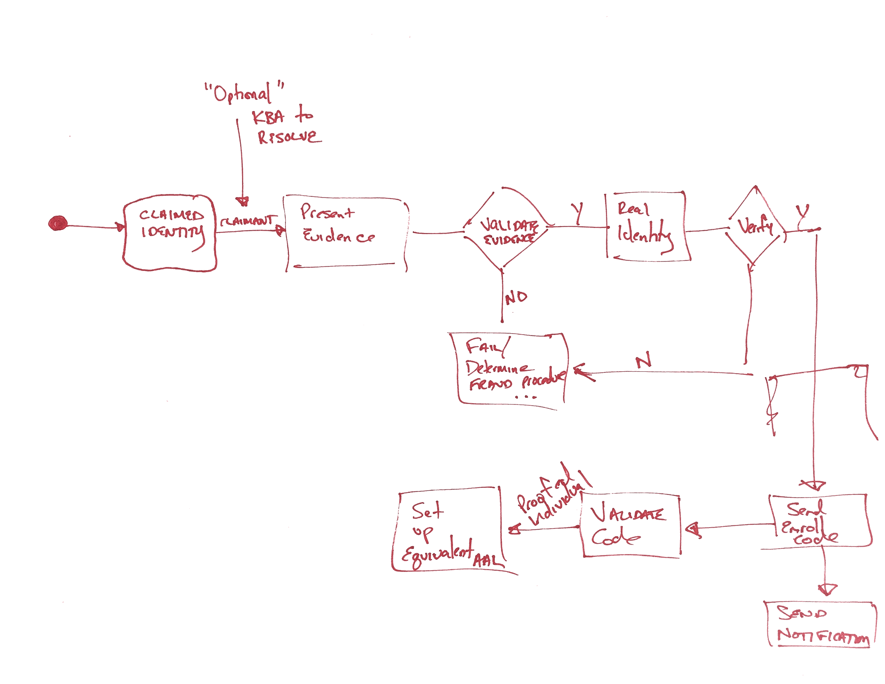

# 1. Purpose

This document provides requirements to fulfill identity proofing of subscribers that wish to gain access to online resources.  The requirements will detail the acceptability, validation, and verification of identity evidence that will be presented by an individual to suppport their claim of identity. 

#2. Introduction

One of the challenges associated with authenticating people is the association of their online activities with a specific physical person. While there are situations where this is not required or is even undesirable (i.e., use cases where anonymity or pseudonymity are required), there are others where it is important to reliably establish the association with a physical person. Examples include obtaining health care and executing financial transactions. There are also situations where the association is required for regulatory reasons (e.g., banking Know Your Customer requirements) or to establish accountability for high-risk actions (e.g., the release of water from a hydroelectric dam). In addition, there are instances where it is desireable to know something about a user executing a transaction, but not knowing the association between the transaction, the person information, and the real human identity of the person.  For example, it may be desirable to know the valid home zip code of a user for purposes of census taking or petitions in order to guarantee integrity of the service, but not necessary or desirable to know the underlying identity of the person.

##2.1 Expected Outcomes of Identity Proofing
The outcome of identity proofing is to ensure:    

* Resolve a claimed identity to a single, unique identity within the context of the population of users the CSP serves
* Validate that all evidence that is supplied is valid and genuine
* Validate that the claimed identity exists in the real world
* Verify that the claimed identity is associated to the real person supplying identity evidence

Identity proofing should only determine that the claimed identity is valid and associated to a real human.  

These technical guidelines apply to remote electronic authentication of human users to digital systems over a network. They do not address the authentication of a person who is physically present, for example, for access to buildings. These technical guidelines establish requirements that Federal IT systems and service providers participating in authentication protocols be authenticated to subscribers. However, these guidelines do not specifically address machine-to-machine (such as router-to-router) authentication, or establish specific requirements for issuing authentication credentials to machines and servers when they are used in e-authentication protocols with people.

##2.2 Identity Assurance Levels
Assurance in a subscriber's identity is described using one of three levels as follows:

###Identity Assurance Level 1
At this level, there is no requirement for a Subscriber's identity be proven.  Attributes (0 to n) provided in conjunction with the authentication process, if any, are self-asserted. 

###Identity Assurance Level 2
**@privacy**

At IAL2, the claimed identity is proven with evidence that supports the real world exisitence of the claimed identity and identifies and verified the person to whom the claimed identity belongs.  IAL 2 introduces the need for either remote or in-person identity proofing.  IAL 2 supports pseudonymous identity with verified attributes. 

###Identity Assurance Level 3
**@privacy**

At Identity Assurance Level 3, in-person identity proofing is required. Identifying attributes must be verified by an authorized and trained representative of the CSP. IAL 3 supports pseudonymous identity with verified attributes.

Subjects may remain pseudonymous at RP's at both IAL2 or 3.  

Detailed requirements for each of the identity assurance levels is given in Section 5.

##2.3 Process Flow
The paradigm of this document is that individuals (referred to as *applicants* at this stage) are enrolled and undergo a registration process, consisting principally of identity proofing, in which their identity attributes are collected and verified. These attributes are then bound to an authenticator (described in SP 800-63B), creating a credential. Higher confidence levels require stronger registration and identity proofing procedures.

###Requirements Notation and Conventions
The key words "MUST", "MUST NOT", "REQUIRED", "SHALL", "SHALL NOT", "SHOULD", "SHOULD NOT", "RECOMMENDED", "NOT RECOMMENDED", "MAY", and "OPTIONAL" in this document are to be interpreted as described in [RFC 2119](http://tools.ietf.org/html/rfc2119).