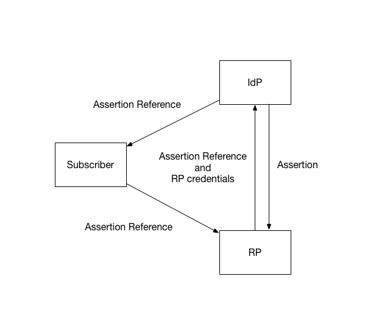
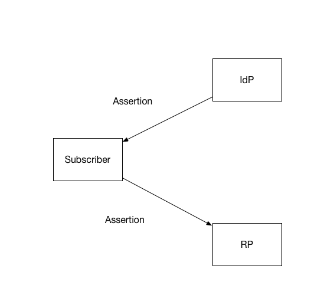

##6. Assertion Presentation

Assertions may be presented in either an *indirect* or *direct* manner from the verifier to the RP. Each model has its benefits and drawbacks. Assertions may also be proxied to facilitate federation between verifiers and RPs.

###6.1. Indirect presentation

In the *indirect* model, the subscriber is given an assertion reference to present to the RP, such as an HTTP redirect. The assertion reference itself contains no information about the subscriber. The RP presents the assertion reference to the verifier, usually along with authentication of the RP itself, to fetch the assertion. 

In this model, the assertion itself is requested directly from the verifier to the RP, minimizing chances of interception and manipulation by a third party (including the subscriber themselves). This also allows the RP to query the verifier for additional attributes about the subscriber not included in the assertion itself.

The assertion is still considered a *bearer* assertion if the artifact required to fetch the Assertion does not require presentation of additional proof of key possession after the assertion has been fetched.

In the indirect method, there are more network transactions required, but the information is limited to the parties that need it. Since an RP is expecting to get an assertion only from the verifier directly, the attack surface is reduced.

###6.2. Direct Presentation

In the *direct* model, the verifier creates an assertion and sends it directly to the subscriber after successful authentication. The assertion is used by the subscriber to authenticate to the RP. This is often handled by mechanisms within the subscriber’s browser.) 

In the direct method, an assertion is visible to the user, which could potentially cause leakage of system information included in the assertion. Since the assertion is visible to the subscirber, the direct method also allows the assertion to be replayed to other RPs by the subscriber. 

In both cases, the assertion needs to be validated in a number of common ways such as issuer verification, signature validation, and audience restriction.

###6.3. Assertion proxying

In some implementations, a proxy takes in an assertion from the verifier  and creates a derived assertion when interacting directly with the RP, acting as an intermediary between the subscriber, verifier, and the RP. (See section 4.1.4.)

There are several common reasons for such proxies:

- Portals that provide users access to multiple RPs that require user authentication

- Web caching mechanisms that are required to satisfy the RP’s access control policies, especially when client-authenticated TLS with the subscriber is required

- Network monitoring and/or filtering mechanisms that terminate TLS in order to inspect and manipulate the traffic

###6.4. Protecting Information

It is good practice to protect communications between the verifier and the RP. Current commercial implementations tend to do this by having the proxy use client-authenticated TLS with the verifier and pass the authentication assertion in the HTTP header.

Note that the verifier may have access to information that may be useful to the RP in enforcing security policies, such as device identity, location, system health checks, and configuration management. If so, it may be a good idea to pass this information along to the RP within the bounds of the subscriber's privacy preferences.

